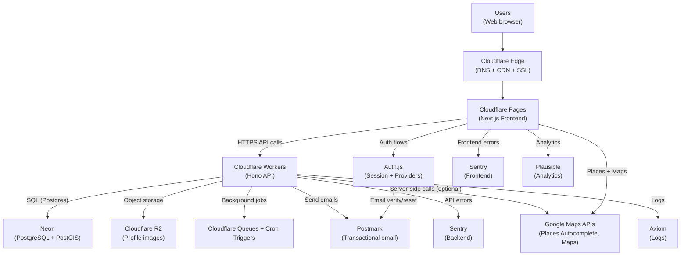
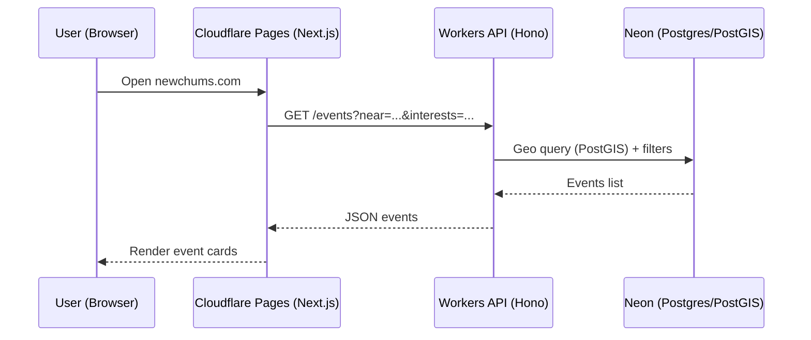
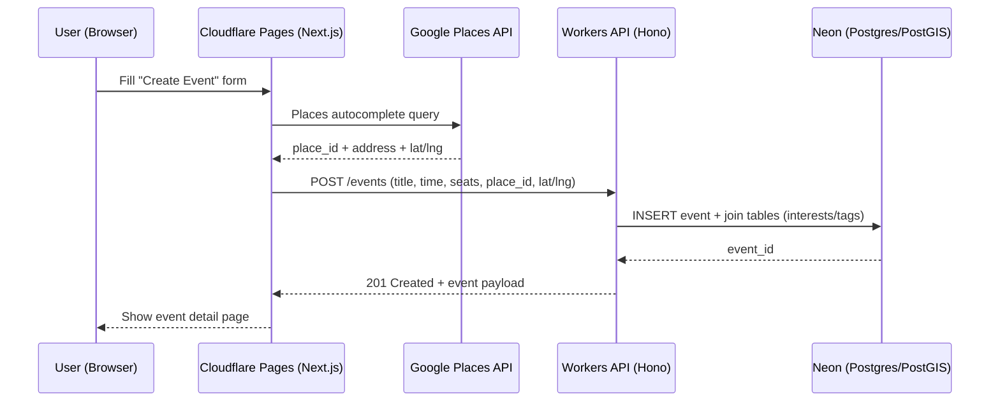
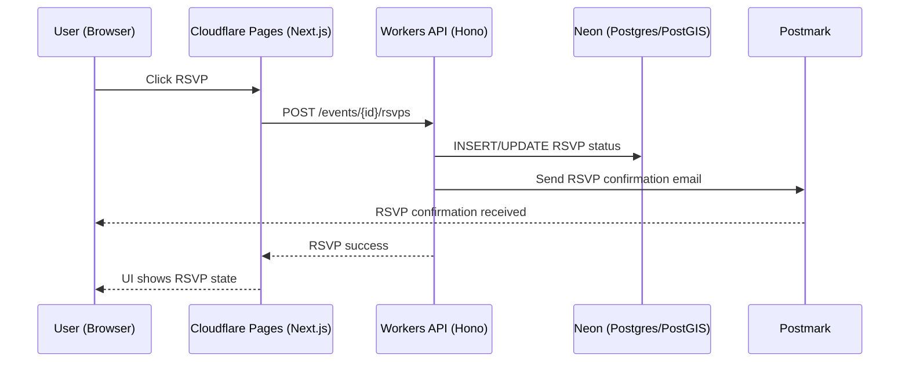
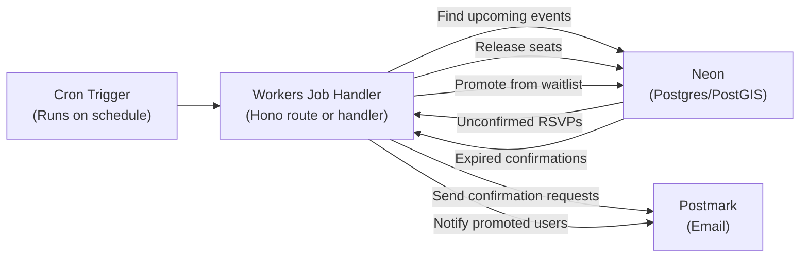
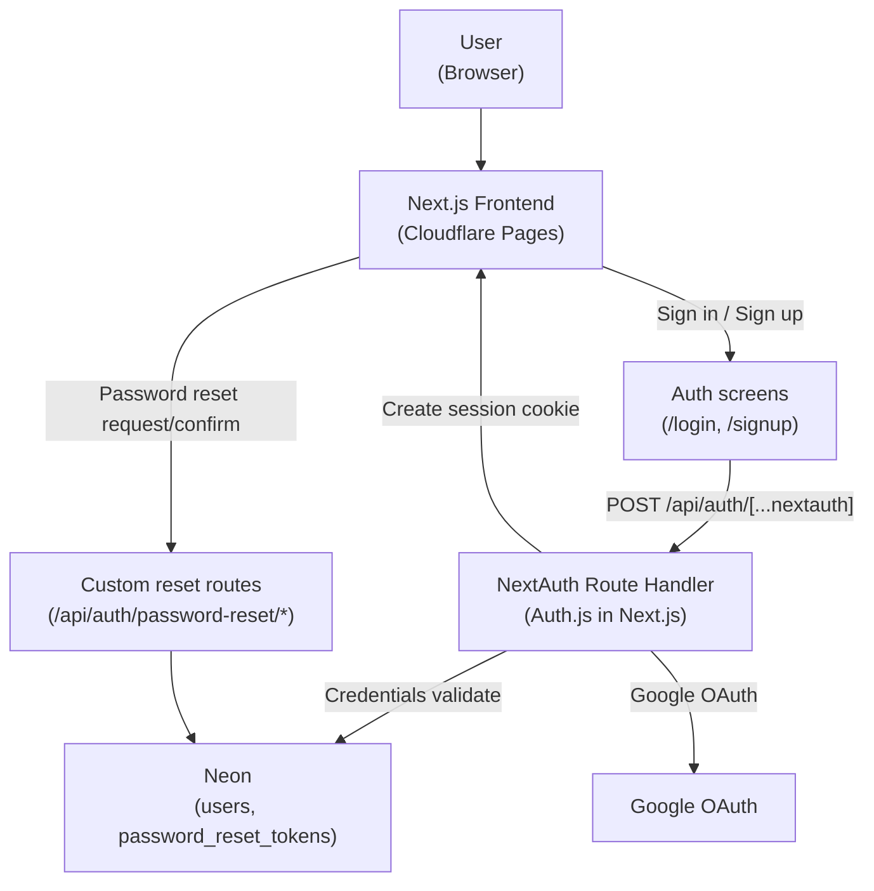
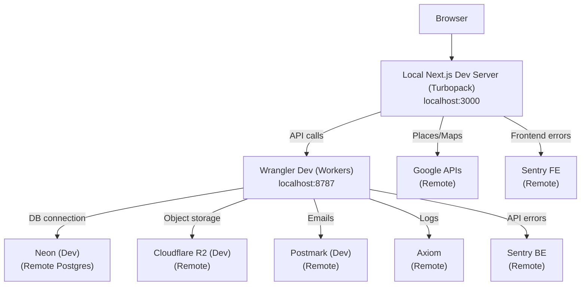
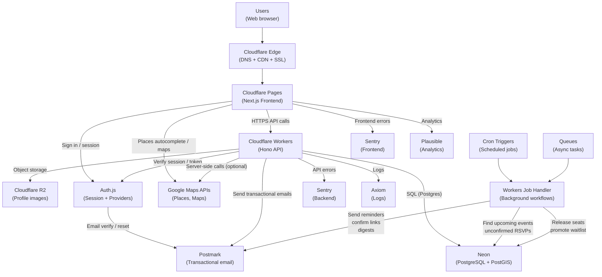
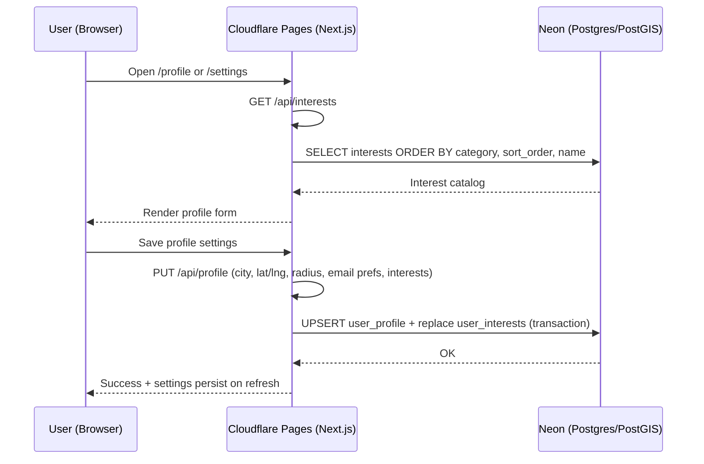

**Last Updated:** February 17, 2026

Absolutely — here’s the **full system mapping regenerated** in a **VS Code Mermaid-extension-friendly** format:

- **No `\n` line breaks**
- Uses **` `** for multi-line labels
- Uses **quoted labels** (`["..."]`) for maximum parser compatibility
- Keeps your **big picture**, **core flows**, **background jobs**, and **local dev** maps

---

## 1) Big-picture production architecture

### Deployment pipeline

1. Developer commits and pushes to **GitHub** (`main`).
2. **Cloudflare Pages** pulls the repo and runs the Next.js build (Cloudflare adapter).
3. Pages publishes the frontend to:
   - `newchums.pages.dev` (auto)
   - `newchums.com` and `www.newchums.com` (custom domains)
4. The frontend calls the API at `NEXT_PUBLIC_API_BASE_URL` (currently `https://newchums-api.robsmith775.workers.dev`).
5. The Workers API is deployed separately via **Wrangler** (`npx wrangler deploy`) and serves both API routes and background triggers.
6. Observability:
   - Frontend errors → Sentry (web project)
   - API errors → Sentry (api project)
   - API logs → Axiom dataset (`newchums-api`)
   - Pageview analytics → Plausible (`newchums.com`)

**Cloudflare Pages note:** because Pages runs server-side Next.js routes on the **Edge runtime**, any non-static route (App Router pages and API route handlers) should export:

`export const runtime = "edge";`

---

## 2) Core user flows (sequence diagrams)

### 2A) Browse & view events

### 2B) Create event (with Places Autocomplete)

### 2C) RSVP flow

---

## 3) Background jobs (24h confirm + waitlist + seat release)

---

## 4) Authentication map (high-level)

**Chunk 9 note:** In production-mode (`npm run build` + `npm run start`) the reset endpoint returns a generic success response and does not expose a reset URL.
Email delivery will be implemented in the Email chunk (Postmark).

---

## 5) Local development architecture (your laptop)

**Chunk 10 note:** Local API DB access is via `wrangler dev --local` reading `DATABASE_URL` from `api/.dev.vars`; deployed uses `wrangler secret put DATABASE_URL`. Dev-only CRUD routes live under `/dev/*`.

---

## 6) One-sentence mental model

**Pages serves the UI, UI calls Workers (API), Workers read/write Neon, store files in R2, and Cron/Queues run background workflows that send emails via Postmark; analytics/logs/errors go to Plausible/Axiom/Sentry.**

## 7) Single Consolidated Model

---

## Chunk 14 Addendum: UI Shell + Design System

- Frontend now has a stable **App Shell** and **route-grouped structure**:
  - `/(public)` for unauthenticated routes
  - `/(app)` for authenticated routes
- Navigation is driven by a shared config (`nav.ts`) so desktop + mobile stay in sync.
- `/ui` is an authenticated UI demo route used to validate theme tokens and internal UI primitives quickly.
- Cloudflare Pages deploys Next.js routes on the Edge runtime; keep runtime expectations aligned with Pages adapter behavior.

---

## Chunk 15 Addendum: Profile Core (Interests + Location + Email Prefs)

### New data model (Neon / Postgres + PostGIS)

- `newchums.interests` (catalog)
- `newchums.user_interests` (junction)
- `newchums.user_profile` (home_city, home_lat, home_lng, home_location geography point, travel_radius_km, email prefs)

### Profile settings flow

### Production auth/env dependencies (Pages)

Auth.js on Cloudflare Pages requires these env vars set in **Pages → Settings → Variables and Secrets**:

- `AUTH_SECRET` (Secret)
- `GOOGLE_CLIENT_ID` (Secret)
- `GOOGLE_CLIENT_SECRET` (Secret)

