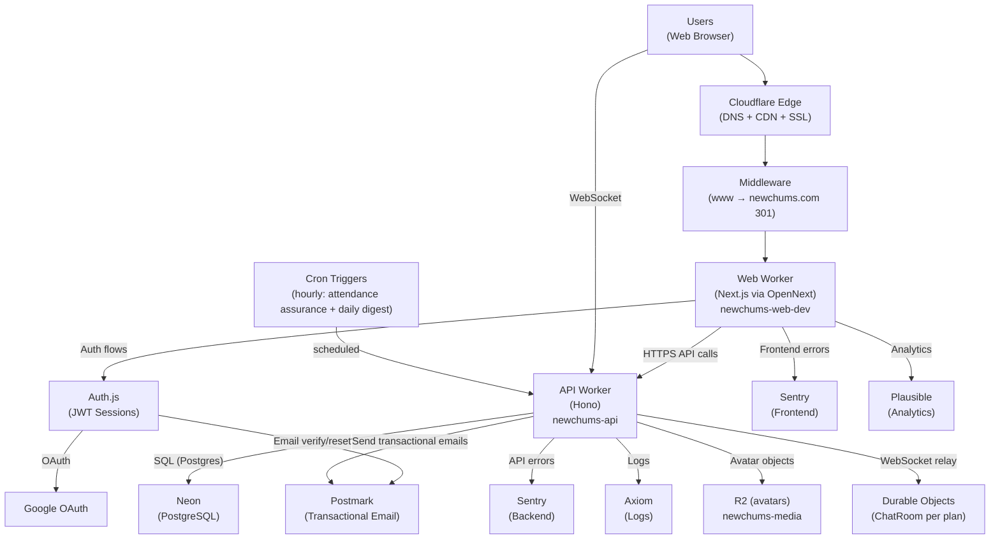
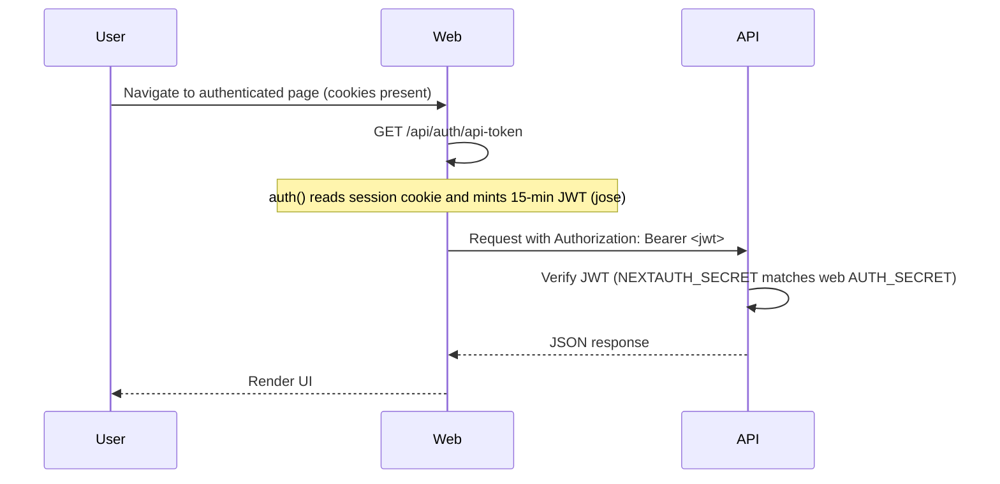
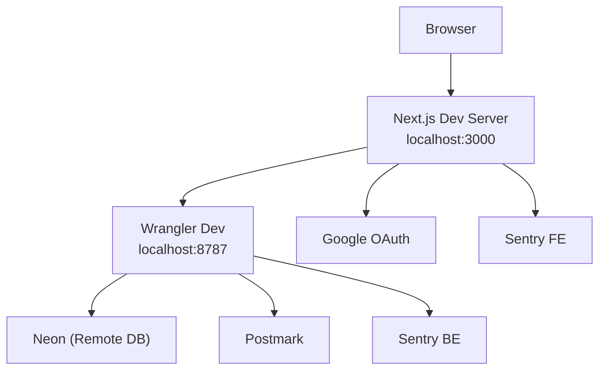
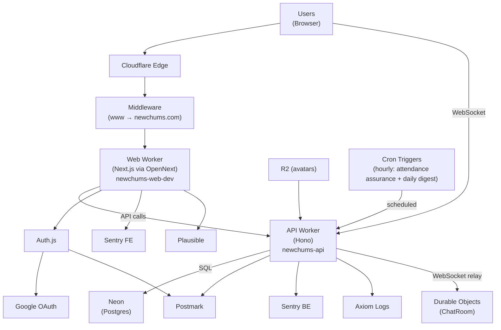

# System Map

Last Updated: March 17, 2026

This document reflects the current production reality of NewChums.
It is diagram-first: use this for boundaries, flows, and "how it connects."

For product context and terminology, see `AGENTS.md`.
For detailed technical specs, see `docs/Technical_Specs.md`.

---

## Production Reality (Current)

- **Single production environment**
- **Web Worker:** `newchums-web-dev` (production; suffix mismatch acknowledged but stable)
- **API Worker:** `newchums-api`
- **Durable Objects:** `ChatRoom` (per-plan WebSocket relay for real-time chat, bound in API worker)
- **Canonical host:** `https://newchums.com`
  - `www.newchums.com` → `newchums.com` enforced via middleware **before** Auth.js
- **Custom domains:** `newchums.com`, `www.newchums.com` (configured in `web/wrangler.toml`)

---

## 1) Big-Picture Production Architecture



---

## 2) Canonical Host Model (OAuth Safety)

All requests to `www.newchums.com` are 301-redirected to `https://newchums.com` (same path + query) **before** Auth.js runs.

This ensures:
- OAuth sign-in and callback share the same origin
- PKCE `code_verifier` cookie is present on callback
- `AUTH_URL` / `NEXTAUTH_URL` remain `https://newchums.com`

Middleware: `web/src/middleware.ts`
Matcher includes `/api/auth/*` (OAuth flow), excludes static assets.

---

## 3) API Boundary — What Lives Where

The following flows run in the API worker; the web app calls the API via `NEXT_PUBLIC_API_BASE_URL`:

| Flow | API endpoint(s) | Auth |
|------|------------------|------|
| Signup | `POST /auth/signup` (with legal acceptance) | none |
| Legal acceptance (OAuth) | `POST /auth/record-legal-acceptance` | Bearer JWT |
| Email verification | `POST /auth/email-verify/request`, `POST /auth/email-verify/confirm`, `GET /auth/email-verify/status` | none |
| Password reset | `POST /auth/password-reset/request`, `POST /auth/password-reset/confirm` | none |
| Email change | `POST /account/email-change/request`, `POST /account/email-change/confirm` | Bearer JWT |
| Password change | `POST /account/password-change` | Bearer JWT (credentials users only) |
| Account deletion | `DELETE /account` | Bearer JWT |
| Notification prefs | `GET /notification-preferences`, `PUT /notification-preferences` | Bearer JWT |
| Privacy prefs | `GET /profile`, `PUT /profile` (privacy columns) | Bearer JWT |
| Interests | `GET /interests` (active only; excludes soft-deleted) | none |
| Profile | `GET /profile` (includes `role`), `PUT /profile` | Bearer JWT |
| Public profile | `GET /public/users/:handle` | none |
| Handle availability | `GET /handles/available?handle=...` | Bearer JWT |
| Onboarding | `POST /user/username`, `POST /user/date-of-birth` | Bearer JWT |
| Avatar upload | `POST /media/init` → PUT to uploadUrl → `POST /media/finalize` | Bearer JWT |
| Avatar remove | `DELETE /profile/avatar` | Bearer JWT |
| Avatar image | `GET /users/:userId/avatar` | public |
| Chums | `GET /chums`, `GET /chums/search`, `GET /chums/check/:userId`, `POST /chums/:userId`, `DELETE /chums/:userId`, `PATCH /chums/:userId/note` | Bearer JWT |
| Chum invites | `POST /chums/invite`, `POST /chums/invite/accept` | Bearer JWT |
| Public Chums | `GET /public/users/:handle/chums` | none |
| Events (plans) | `POST /events`, `GET /events/mine`, `GET /events/:id` (optional auth — returns `accessState` + `shareToken`), `GET /events/explore` (auth), `GET /events/explore/public` (no auth), `PATCH /events/:id`, `POST /events/:id/rsvp`, `POST /events/:id/alt-time`, `POST /events/:id/cancel`, `POST /events/:id/invite`, `POST /events/:id/confirm`, `POST /events/:id/email-confirm` | Bearer JWT (detail: optional; accepts `invite_token` / `participation_token` / `share_token`); explore/public: no auth |
| Attendance record | `GET /public/users/:userId/attendance-record` | none |
| Plan chat | `GET /events/:id/chat`, `POST /events/:id/chat`, `POST /events/:id/chat/read`, `GET /events/:id/chat/ws` (WebSocket upgrade) | Bearer JWT |
| Plan lock | `POST /events/:id/lock` | Bearer JWT (host only) |
| Notifications | `GET /notifications` (includes `unreadChats`), `POST /notifications/read` | Bearer JWT |
| Email unsubscribe | `POST /email/unsubscribe` | Signed JWT token |
| Contact form | `POST /contact` | none (Turnstile for logged-out) |
| Admin — interests | `GET /admin/interests`, `PATCH /admin/interests/:id`, `DELETE /admin/interests/:id`, `POST /admin/interests/:id/restore`, `POST /admin/interests/merge` | Bearer JWT + `super_admin` role |
| Admin — users | `GET /admin/users`, `POST /admin/users/:id/suspend`, `POST /admin/users/:id/unsuspend` | Bearer JWT + `super_admin` role |
| Diagnostics | `GET /health`, `GET /health/env` | none |

### Content safety

Signup, onboarding username, and profile edits validate:
- display name
- handle/username
- hobbies

Invalid returns 400 with `code: "INAPPROPRIATE_TEXT"` and `field`.

---

## 4) Auth-to-API Token Flow (Bearer JWT)

Authenticated API calls use a short-lived Bearer token minted by the Web Worker:



---

## 5) Key User Flows

### Background digest emails (API `scheduled`)

The hourly cron runs attendance assurance, then unread-chat digest (daily gate), then the **event match digest** (“new plans matching my interests”). Recipients need home location, travel radius, and the `event_match` preference. **Public** in-person plans require hobby overlap with the plan within travel radius (and the other digest gates). **Chums-only** in-person plans use the **same** hobby and distance rules; the recipient must also be on the **host’s** On NewChums connections (`user_contacts`, `type = 'on_newchums'`). **Invite-only** plans are excluded.

### Logged-out visitor flow

```
Visit newchums.com → Homepage (LandingLayout)
├── Public Explore feed — browse real public plans (search, time filter, pagination)
│   └── Click plan → Public plan details (limited preview, no RSVP)
├── Browse: How it Works, Science of Friendship, Safety Center
├── Contact form
├── Sign up (multi-step: credentials + legal acceptance → username/DOB → hobbies → location) → Email verification → Dashboard
├── Sign up (Google OAuth + legal acceptance) → Onboarding (username/DOB → hobbies → location) → Dashboard
└── Sign in → Dashboard (Explore)
```

### Logged-in core flow

```
Sign in → Explore (event discovery feed)
├── Start a plan → Create event form → Publish → Your Plans
├── Explore → Browse events → RSVP / Suggest alt time
├── Your Plans → Upcoming / Past tabs → Event detail
├── Your Chums → Search / Add / Remove / Invite by email
├── Profile → Edit → Public profile (/u/handle)
├── Settings → Notifications / Privacy / Email / Password / Delete account
└── Notifications (bell) → View / mark read
```

### Plan access state flow

Every `GET /events/:id` request resolves to one of four access states based on the viewer's identity and context:

```
Visit /events/[id]
├── No auth, no token → accessState: "public"
│   └── Limited preview (title, description, date, hobby, host, counts, approximate location)
│       └── CTA: Sign in / Create account
│       └── No email RSVP flow
├── ?share_token=xxx (Copy Link) → accessState: "invite"
│   └── Full detail + email RSVP flow (email verification → participation token → RSVP)
├── ?invite_token=xxx (invite email) → accessState: "invite"
│   └── Full detail + guest RSVP buttons
├── ?participation_token=xxx (returning guest) → accessState: "invite"
│   └── Full detail + existing guest RSVP state
├── Logged in, not attending → accessState: "authenticated"
│   └── Full detail, can RSVP or request to join
└── Logged in + host or RSVP → accessState: "attending"
    └── Full detail + chat, host controls, exact location
```

**Share link flow:** Copy Link → generates `/events/[id]?share_token=xxx` → recipient opens link → API validates token → `accessState: "invite"` → email RSVP flow available. Without a valid token, plain `/events/[id]` shows public preview only.

---

## 6) Local Development Model

- Web dev server: `localhost:3000`
- API dev server: `localhost:8787` (Wrangler dev)
- Neon DB: remote
- Postmark: used for email dispatch (dev/prod tokens as configured)



---

## 7) Deploy Configuration (Production)

| Setting | Value |
|---------|-------|
| Web Worker name | `newchums-web-dev` |
| API Worker name | `newchums-api` |
| Custom domains | `newchums.com`, `www.newchums.com` |
| Canonical host | `https://newchums.com` |
| `workers_dev` | `false` |
| `preview_urls` | `false` |

Wrangler config is code-managed so deploys do not wipe routes or override canonical host vars.

---

## 8) Web App Route Map

### Public routes (LandingLayout)

| Route | Purpose |
|-------|---------|
| `/` (logged out) | Homepage — hero, public Explore feed (real public plans via `/events/explore/public`), brand positioning, feature blocks, CTA |
| `/how-it-works` | How it works |
| `/science-of-friendship` | Research-backed trust page |
| `/safety-center` | Community safety guidance |
| `/contact` | Contact form (Turnstile for logged-out) |
| `/login` | Sign in |
| `/signup` | Create account (multi-step wizard) |
| `/forgot-password` | Request password reset |
| `/reset-password` | Set new password |
| `/auth/verify` | Email verification landing |
| `/auth/verify-pending` | Verification pending polling page |
| `/u/[handle]` | Public profile (works logged-in or out) |
| `/events/[id]` (logged out) | Plan detail — public preview with limited info and sign-in CTA |
| `/terms` | Terms of Use |
| `/privacy` | Privacy Policy |

### Logged-in routes (AppShell)

| Route | Purpose |
|-------|---------|
| `/` (logged in) | Explore — event discovery feed |
| `/events/create` | Start a plan (create event) |
| `/plans` | Your Plans — upcoming / past tabs |
| `/events/[id]` | Event detail — full experience with RSVP, attendees, chat, lock, cancel (access state: authenticated/attending) |
| `/chum-groups` | Your Chums — search, invite, list |
| `/profile` | Edit profile |
| `/settings` | Notifications, privacy, account |
| `/admin/interests` | Interests moderation (super_admin) |
| `/admin/chums` | User management (super_admin) |
| `/unsubscribe` | Email notification unsubscribe (public, token-based) |

---

## 9) Single Consolidated System Model


