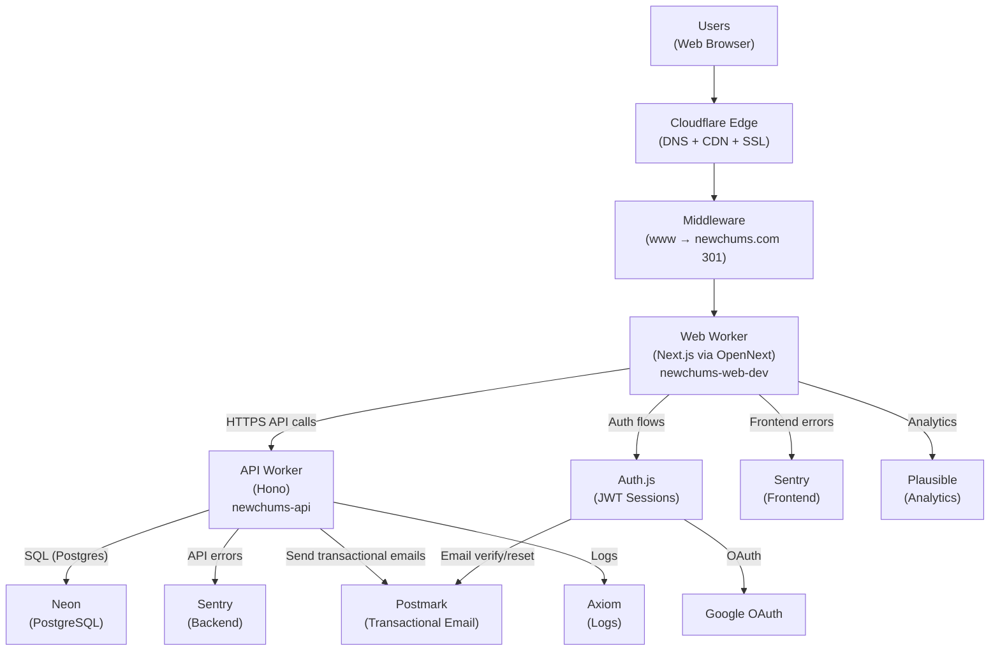
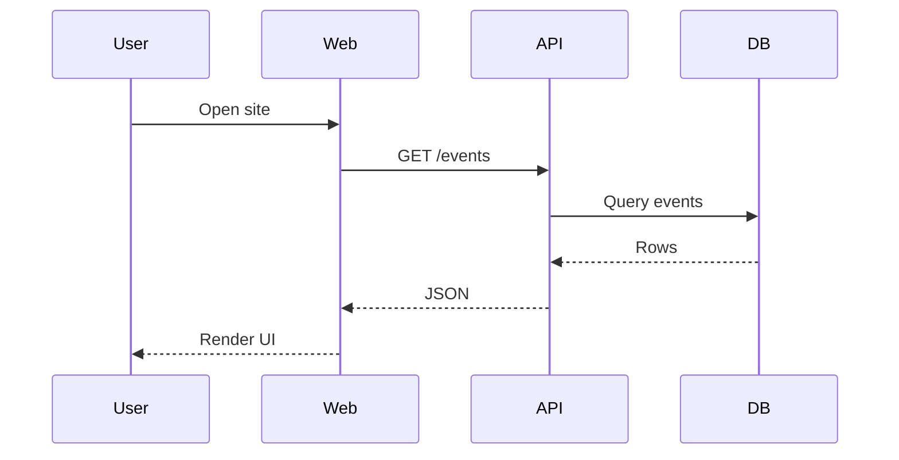
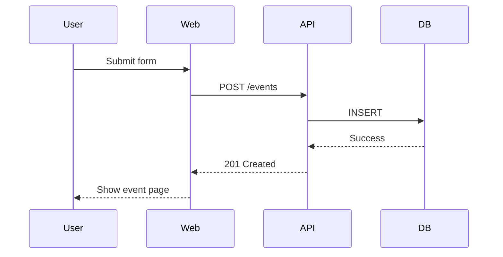
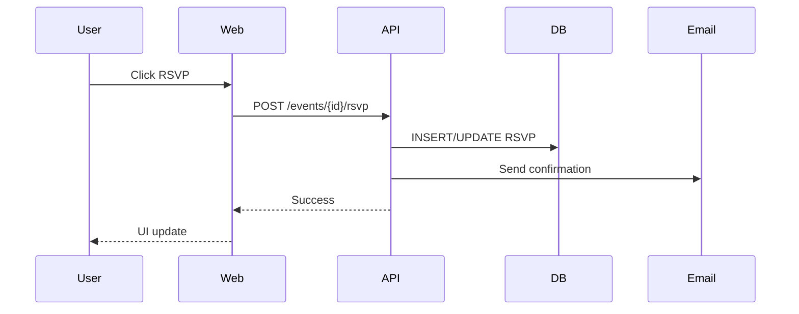
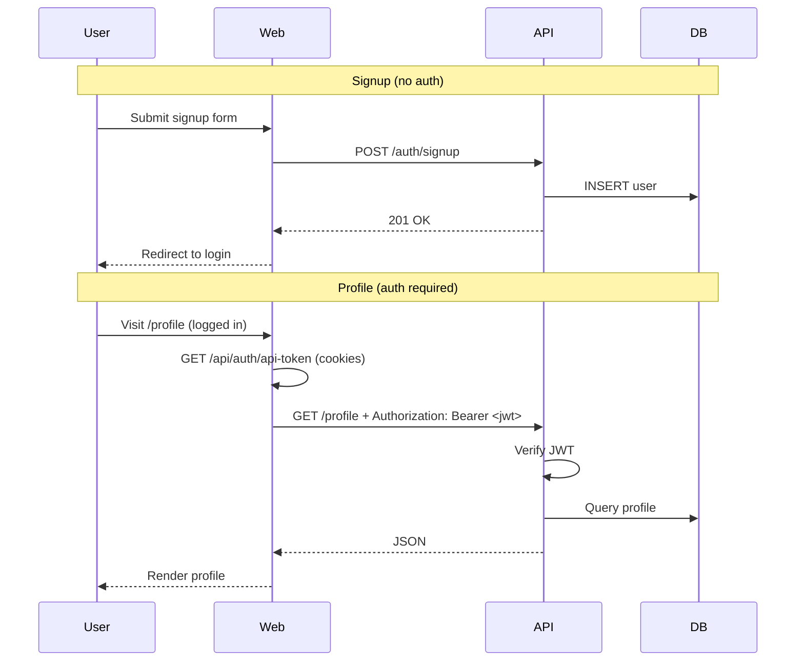
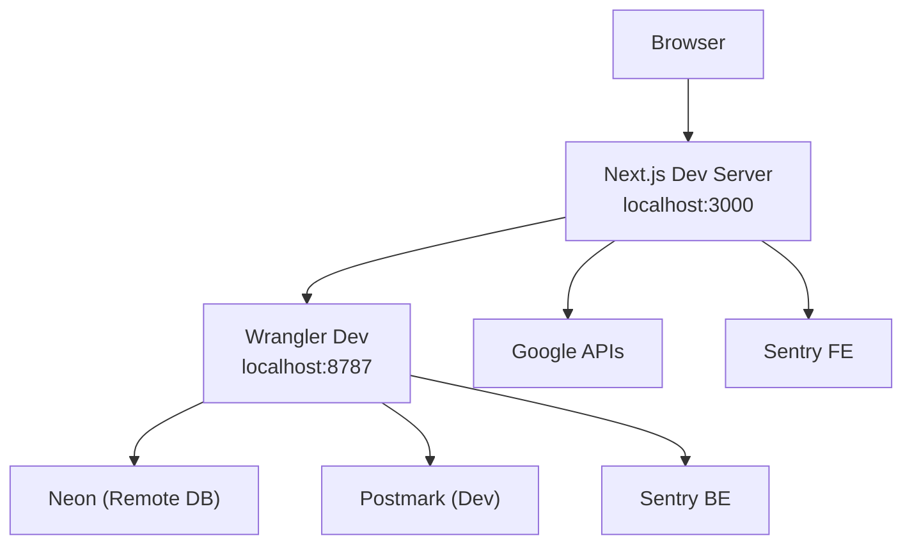
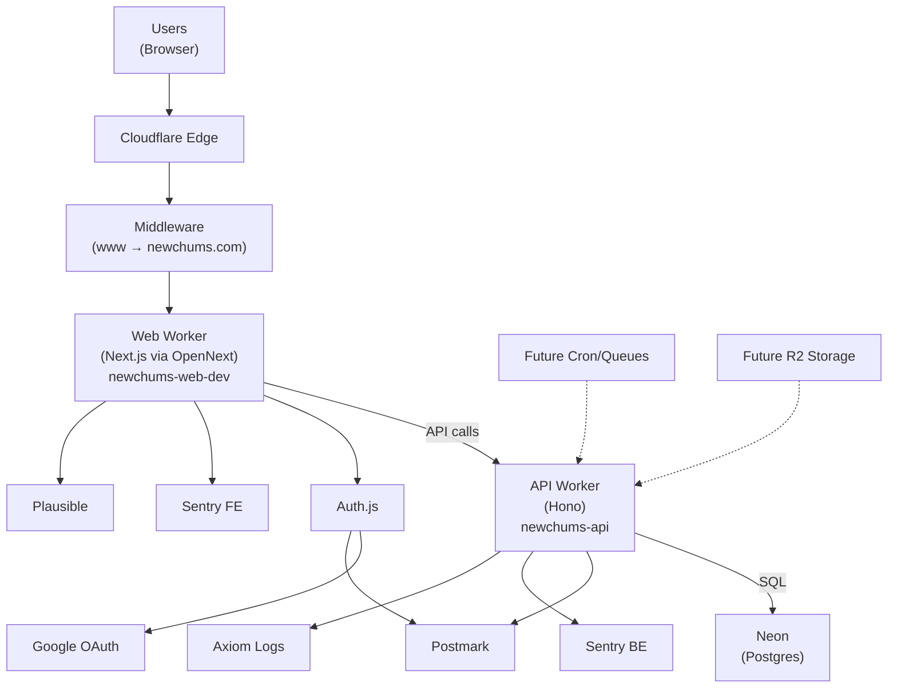

# System Map

Last Updated: February 24, 2026

This document reflects the current production reality of NewChums.

## Production Workers

- **Web Worker:** `newchums-web-dev` (production despite suffix)
- **API Worker:** `newchums-api`
- **Single production environment**
- **Canonical domain:** `https://newchums.com` (live; www → non-www redirect enforced)
- **Custom domains:** newchums.com, www.newchums.com (defined in wrangler.toml)

---

# 1) Big‑Picture Production Architecture



---

# 2) Canonical Host Model

All requests to `www.newchums.com` are 301-redirected to `https://newchums.com` (same path + query) **before** Auth.js runs. This ensures:

- OAuth signin and callback share the same origin
- PKCE `code_verifier` cookie is available on callback
- AUTH_URL / NEXTAUTH_URL are `https://newchums.com`

Middleware: `web/src/middleware.ts` — runs on all paths except static assets; includes `/api/auth/*`.

---

# 3) API Migration (Web → API Worker)

The following flows now run entirely in the API worker; the web app calls the API directly via `NEXT_PUBLIC_API_BASE_URL`:

| Flow | API endpoint | Auth |
|------|--------------|------|
| Signup | POST /auth/signup | None |
| Password reset request | POST /auth/password-reset/request | None |
| Password reset confirm | POST /auth/password-reset/confirm | None |
| Interests list | GET /interests | None |
| Profile (get/update) | GET /profile, PUT /profile | Bearer JWT |
| Set username (onboarding) | POST /user/username | Bearer JWT |
| Set date of birth (onboarding) | POST /user/date-of-birth | Bearer JWT |

**Auth flow:** For authenticated routes, the client calls `GET /api/auth/api-token` (same-origin, cookies sent). The route uses auth() to get the session, then mints a 15-min JWT with jose. The client passes it as `Authorization: Bearer <token>` to the API. The API verifies using jose (API token) or @auth/core (Auth.js session JWT). NEXTAUTH_SECRET must match web AUTH_SECRET. CORS: explicit allowlist (newchums.com, www, localhost:3000).

**Password-reset email:** Token creation is implemented; sending the email is not yet wired (planned follow-up).

---

# 4) Core User Flows

## Browse Events



## Create Event



## RSVP



## Signup / Profile (API Worker)



## Google OAuth (Canonical Host Enforced)

```mermaid
sequenceDiagram
  participant User
  participant www
  participant MW as Middleware
  participant Web
  participant Google

  User->>www: Visit www.newchums.com/api/auth/signin/google
  www->>MW: Request
  MW->>User: 301 → https://newchums.com/api/auth/signin/google
  User->>Web: GET newchums.com/.../signin/google
  Web->>Google: Redirect to Google
  Google->>User: Auth
  User->>Web: Callback → newchums.com/api/auth/callback/google
  Note over Web: Same origin; PKCE verifier matches
  Web-->>User: Session established
```

---

# 5) Local Development Model

Local API: `npm run dev` in `api/` → Wrangler dev on port 8787. Diagnostic: `GET http://localhost:8787/health/env` reports DATABASE_URL, NEXTAUTH_SECRET, WEB_BASE_URL presence.



---

# 6) Architectural Commitments

- Two-worker model is intentional and long-term.
- Business logic belongs in API Worker.
- Web Worker focuses on UI and auth orchestration (Auth.js, /api/auth/[...nextauth]).
- Core user flows (signup, profile, interests, password reset, onboarding) now live in API worker.
- Canonical host is non-www; middleware enforces before Auth.js.
- R2 and background jobs (Cron/Queues) are planned but not yet implemented.
- Single production environment currently active.
- Wrangler config (routes, workers_dev, vars) is code-managed to prevent deploy drift.

---

# 7) Deploy Configuration (Production)

| Setting | Value |
|---------|-------|
| Web Worker name | newchums-web-dev |
| API Worker name | newchums-api |
| Custom domains | newchums.com, www.newchums.com |
| AUTH_URL / NEXTAUTH_URL | https://newchums.com |
| workers_dev | false |
| preview_urls | false |

Routes and vars in wrangler.toml match remote; deploy no longer wipes custom domains or overrides AUTH_URL. API: deploy root worker with `npm run deploy` in api/.

---

# 8) Single Consolidated System Model


