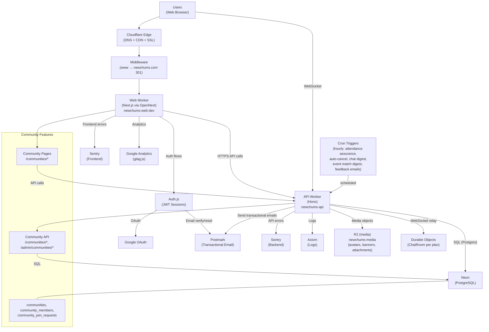
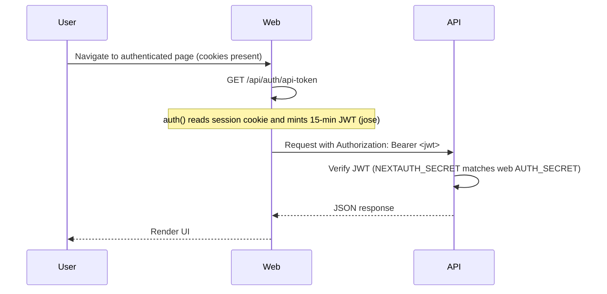
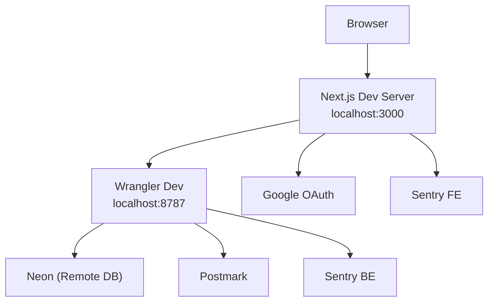
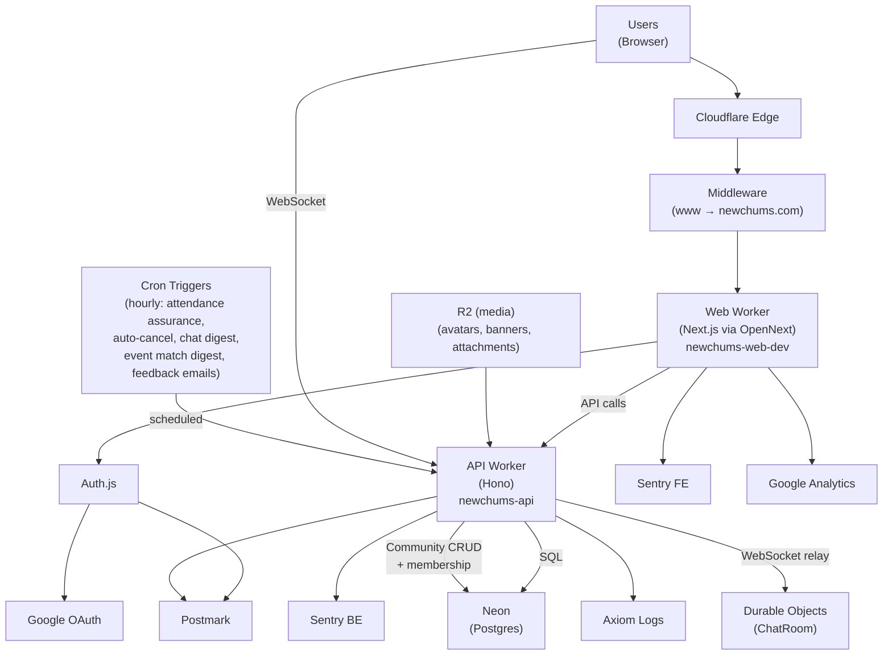

# System Map

Last Updated: March 31, 2026

This document reflects the current production reality of NewChums.
It is diagram-first: use this for boundaries, flows, and "how it connects."

For product context and terminology, see `AGENTS.md`.
For detailed technical specs, see `docs/Technical_Specs.md`.

---

## Production Reality (Current)

- **Single production environment**
- **Web Worker:** `newchums-web-dev` (production; suffix mismatch acknowledged but stable)
- **API Worker:** `newchums-api`
- **Durable Objects:** `ChatRoom` (per-plan WebSocket relay for real-time chat, bound in API worker)
- **Canonical host:** `https://newchums.com`
  - `www.newchums.com` → `newchums.com` enforced via middleware **before** Auth.js
- **Custom domains:** `newchums.com`, `www.newchums.com` (configured in `web/wrangler.toml`)

---

## 1) Big-Picture Production Architecture



---

## 2) Canonical Host Model (OAuth Safety)

All requests to `www.newchums.com` are 301-redirected to `https://newchums.com` (same path + query) **before** Auth.js runs.

This ensures:
- OAuth sign-in and callback share the same origin
- PKCE `code_verifier` cookie is present on callback
- `AUTH_URL` / `NEXTAUTH_URL` remain `https://newchums.com`

Middleware: `web/src/middleware.ts`
Matcher includes `/api/auth/*` (OAuth flow), excludes static assets.

---

## 3) API Boundary, What Lives Where

The following flows run in the API worker; the web app calls the API via `NEXT_PUBLIC_API_BASE_URL`:

| Flow | API endpoint(s) | Auth |
|------|------------------|------|
| Signup | `POST /auth/signup` (with legal acceptance) | none |
| Legal acceptance (OAuth) | `POST /auth/record-legal-acceptance` | Bearer JWT |
| Email verification | `POST /auth/email-verify/request`, `POST /auth/email-verify/confirm`, `GET /auth/email-verify/status`, `POST /auth/email-verify/mark-oauth` | none |
| Password reset | `POST /auth/password-reset/request`, `POST /auth/password-reset/confirm` | none |
| Email change | `POST /account/email-change/request`, `POST /account/email-change/confirm` | Bearer JWT |
| Password change | `POST /account/password-change` | Bearer JWT (credentials users only) |
| Account deletion | `DELETE /account` | Bearer JWT |
| Notification prefs | `GET /notification-preferences`, `PUT /notification-preferences` | Bearer JWT |
| Privacy prefs | `GET /profile`, `PUT /profile` (privacy columns) | Bearer JWT |
| Interests | `GET /interests` (active only; excludes soft-deleted) | none |
| Profile | `GET /profile` (includes `role`), `PUT /profile` | Bearer JWT |
| Public profile | `GET /public/users/:handle` | optional Bearer JWT (auth-aware: logged-out viewers see username only, no name/age/gender) |
| Handle availability | `GET /handles/available?handle=...` | Bearer JWT |
| Objectives / nudge | `GET /objectives/next`, `PUT /objectives/tutorial-off` | Bearer JWT |
| Onboarding | `POST /user/username`, `POST /user/date-of-birth` | Bearer JWT |
| Media upload | `POST /media/init` → `PUT /media/upload/:token` → `POST /media/finalize` | Bearer JWT |
| Avatar remove | `DELETE /profile/avatar` | Bearer JWT |
| Avatar image | `GET /users/:userId/avatar` | public |
| Event banner image | `GET /events/:eventId/banner` | public |
| Community avatar image | `GET /communities/:communityId/avatar` | public |
| Chums | `GET /chums`, `GET /chums/search`, `GET /chums/check/:userId`, `POST /chums/:userId`, `POST /chums/private`, `DELETE /chums/:id`, `PATCH /chums/:contactId/note` | Bearer JWT |
| Chum invites | `POST /chums/invite`, `POST /chums/invite/accept` | Bearer JWT |
| Public Chums | `GET /public/users/:handle/chums` | none |
| Events (plans) | `POST /events`, `GET /events/mine`, `GET /events/:id` (optional auth, returns `accessState` + `shareToken`), `GET /events/explore` (auth), `GET /events/explore/public` (no auth), `PATCH /events/:id`, `POST /events/:id/cancel` | Bearer JWT (detail: optional; accepts `invite_token` / `participation_token` / `share_token`); explore/public: no auth |
| Explore support | `GET /explore/local-signal` | Bearer JWT |
| Plan RSVP | `POST /events/:id/rsvp`, `POST /events/:id/email-rsvp`, `POST /events/:id/public-rsvp/request-code`, `POST /events/:id/public-rsvp/confirm-code`, `POST /events/:id/confirm`, `POST /events/:id/guest-confirm` | Bearer JWT / token-based |
| Plan alt times | `POST /events/:id/alt-time`, `PATCH /events/:id/alt-time/:altTimeId`, `DELETE /events/:id/alt-time/:altTimeId`, `POST /events/:id/guest-alt-time`, `POST /events/:id/promote-alt-time` | Bearer JWT |
| Plan attendee mgmt | `POST /events/:id/invite`, `POST /events/:id/remove-attendee`, `POST /events/:id/remove-invite`, `POST /events/:id/reserve-seats`, `POST /events/:id/toggle-attendee-invites` | Bearer JWT (host only) |
| Plan join requests | `POST /events/:id/join-request`, `POST /events/:id/join-request/:requestId/approve`, `POST /events/:id/join-request/:requestId/decline`, `POST /events/:id/join-request/:requestId/withdraw` | Bearer JWT |
| Plan lock | `POST /events/:id/lock` | Bearer JWT (host only) |
| Plan privacy | `POST /events/:id/hide-name` | Bearer JWT. Toggles the viewer's `hide_name` flag on their RSVP. When active, real name is masked in attendee list; @handle and avatar remain visible. |
| Plan feedback | `GET /events/:id/feedback`, `POST /events/:id/feedback` (updates `user_metrics`), `POST /events/:id/feedback/dismiss`, `POST /events/:id/attendance-issue` (penalizes reliability), `POST /events/:id/attendance-dispute`, `POST /events/:id/conduct-report`, `POST /events/:id/shoutout` (optional moderated positive note) | Bearer JWT |
| Shout-outs | `GET /public/users/:handle/shoutouts` (approved shout-outs on the recipient's public profile, gated by `is_hidden_shoutouts`; auth optional, owner sees their own items even when hidden), `POST /events/:id/shoutout` (sender) | Optional Bearer JWT (owner) / Bearer JWT (sender) |
| Chum preferences | `GET /chum-preferences`, `PUT /chum-preferences` | Bearer JWT |
| Attendance record | `GET /public/users/:userId/attendance-record` | none. Response includes `badges` array with local recognition badges (Top Attendee, Top Host) computed from rolling 12-month activity within 50 km. |
| Plan chat | `GET /events/:id/chat`, `POST /events/:id/chat`, `POST /events/:id/chat/read`, `GET /events/:id/chat/ws` (WebSocket upgrade) | Bearer JWT |
| Notifications | `GET /notifications` (includes `unreadChats`), `POST /notifications/read` | Bearer JWT |
| Email unsubscribe | `POST /email/unsubscribe` | Signed JWT token |
| Contact form | `POST /contact` | none (Turnstile for logged-out) |
| UI state | `PUT /share-link-modal-dismiss` | Bearer JWT |
| Roadmap | `GET /roadmap`, `GET /roadmap/:id`, `POST /roadmap`, `PUT /roadmap/:id`, `DELETE /roadmap/:id`, `POST /roadmap/:id/vote`, `POST /roadmap/:id/follow`, `POST /roadmap/:id/comment`, `GET /roadmap/:id/attachment` | Bearer JWT. List and detail endpoints filter out "received" status items unless viewer is author or super_admin. Anonymous submissions (`is_anonymous`) show `@anonymous` publicly; admin endpoints always show real author. Statuses: received, needs_clarification, in_progress, planned, completed, not_planned. |
| Admin, interests | `GET /admin/interests`, `GET /admin/interests/categories`, `PATCH /admin/interests/:id`, `DELETE /admin/interests/:id`, `POST /admin/interests/:id/restore`, `POST /admin/interests/merge` | Bearer JWT + `super_admin` role |
| Admin, users | `GET /admin/users`, `POST /admin/users/:id/suspend`, `POST /admin/users/:id/unsuspend`, `GET /admin/users/:id/diagnostics`, `PUT /admin/users/:id/metrics` | Bearer JWT + `super_admin` role |
| Admin, safety | `PUT /admin/attendance-issues/:id/status`, `GET /admin/concern-reports`, `PUT /admin/concern-reports/:id/status` | Bearer JWT + `super_admin` role |
| Admin, shout-outs | `GET /admin/shoutouts`, `POST /admin/shoutouts/:id/status` (approve/reject; approval inserts a `shoutout_received` notification for the recipient, no email; the bell deep-links to `/u/<handle>#shoutouts`) | Bearer JWT + `super_admin` role |
| Admin, dashboard | `GET /admin/badge-counts`, `POST /admin/mark-viewed`, `GET /admin/kpis`, `GET /admin/kpis/growth-loop/filters`, `GET /admin/kpis/growth-loop`, `GET /admin/objectives/kpi` | Bearer JWT + `super_admin` role |
| Admin, plans | `GET /admin/plans`, `POST /admin/plans/:id/remove` | Bearer JWT + `super_admin` role |
| Admin, roadmap | `GET /admin/roadmap`, `POST /admin/roadmap/:id/status`, `POST /admin/roadmap/:id/merge`, `POST /admin/roadmap/:id/edit`, `POST /admin/roadmap/:id/remove`, `POST /admin/roadmap/:id/restore`, `DELETE /admin/roadmap/comments/:id` | Bearer JWT + `super_admin` role |
| Communities | `POST /communities`, `GET /communities`, `GET /communities/slug-available`, `GET /communities/:slug`, `PATCH /communities/:slug`, `POST /communities/:slug/close`, `DELETE /communities/:slug`, `POST /communities/:id/join`, `POST /communities/:id/leave`, `GET /communities/:id/members`, `POST /communities/:id/members/:userId/remove`, `PUT /communities/:id/join-requests/:requestId`, `GET /communities/:id/join-requests`, `GET /communities/:id/events` | Bearer JWT |
| Admin, communities | `GET /admin/communities`, `POST /admin/communities/:id/remove` | Bearer JWT + `super_admin` role |
| Diagnostics | `GET /`, `GET /health`, `GET /health/env`, `GET /health/db`, `GET /db/ping`, `GET /db/postgis` | none |

### QA plan isolation

Plans with `is_qa = true` are isolated from normal users but fully functional for super admins.

**Normal users** never see QA plans. They are excluded from:
- All feeds, notifications, emails, and chat
- Direct URL access (returns 404)
- RSVP, invite, join request, and all interaction endpoints

**Super admins** get a fully realistic experience with QA plans:
- QA plans appear in Explore feed, Your Plans, community plan feeds
- Cron jobs (attendance assurance, event match digest, chat digest, feedback reminders) process QA plans and send emails/notifications to super admin recipients only
- Auto-cancel and attendance cutoff processing runs normally on QA plans
- QA plans are excluded from KPI metrics and the public (unauthenticated) explore feed

Enforcement: list queries use `AND (COALESCE(e.is_qa, false) = false OR <viewer_is_super_admin>)`. Single-event endpoints check `is_qa` and verify super_admin role, returning 404 for non-admins. Cron jobs check recipient role via `batchLoadSuperAdminIds()` before sending.

### Content safety

Signup, onboarding username, and profile edits validate:
- display name
- handle/username
- hobbies

Invalid returns 400 with `code: "INAPPROPRIATE_TEXT"` and `field`.

---

## 4) Auth-to-API Token Flow (Bearer JWT)

Authenticated API calls use a short-lived Bearer token minted by the Web Worker:



---

## 5) Key User Flows

### Background scheduled tasks (API `scheduled`, hourly cron)

The hourly cron runs five tasks in sequence:

1. **Attendance assurance** -- validates and manages event attendance
2. **Auto-cancel plans** -- cancels published plans whose event time has passed with no attendees beyond the host (within a 2-hour window)
3. **Unread chat digest** -- sends digest emails for unread chat messages (daily gate, 23-hour cooldown)
4. **Event match digest** -- “new plans matching my interests.” Recipients need home location, travel radius, and the `event_match` preference. **Public** in-person plans require **effective-category overlap** with the plan within travel radius (and the other digest gates). **Chums-only** in-person plans use the **same** category and distance rules; the recipient must also be on the **host’s** On NewChums connections (`user_contacts`, `type = ‘on_newchums’`). **Invite-only** plans are excluded. **Already-connected suppression:** plans where the recipient already has any RSVP row (any status) or any invite row (matched by `user_id` or by `LOWER(email) = LOWER(users.email)`) are excluded so the digest never overlaps with direct outreach. *Effective category* of an interest is `LOWER(COALESCE(NULLIF(TRIM(category), ''), name))` -- so two interests in the same admin-assigned category match (e.g. "MTG Draft" and "MTG Commander" with category `MTG`), and an interest with no category falls back to its own name. The same effective-category rule is applied by the authenticated Explore feed (hobby filter + match-count ranking), the public Explore feed (hobby filter), and the local-signal endpoint at the bottom of the Explore feed. The shared TypeScript helper is `effectiveCategoryOf` in `web/src/lib/interestUtils.ts`.
5. **Post-plan feedback emails** -- sends feedback request 3+ hours after a plan ends to attendees

After the SQL selects candidate (recipient, plan) pairs, **chum preference filtering** applies two checks: (1) the host's metrics must meet the recipient's chum preference thresholds, and (2) the recipient's metrics must meet the host's thresholds. Both must pass for a plan to appear in a digest. **Plan-level preference overrides** (`pref_overrides` JSONB on events) are respected: `{ "disabled": true }` bypasses all host preference checks for that plan; `{ "disabled_metrics": [...] }` bypasses specific metrics only. The **Explore feed** also enforces the host's chum preferences as a hard filter (respecting plan-level overrides in SQL); the viewer's own preferences produce informational compatibility notes but do not hide plans.

### Logged-out visitor flow

```
Visit newchums.com → Homepage (LandingLayout)
├── Public Explore feed, browse real public plans (search, time filter, pagination)
│   └── Click plan → Public plan details (limited preview, no RSVP)
├── Browse: How it Works, Science of Friendship, Safety Center
├── Contact form
├── Sign up (multi-step: credentials + legal acceptance → username/DOB → hobbies → location) → Email verification → Dashboard
├── Sign up (Google OAuth + legal acceptance) → Onboarding (username/DOB → hobbies → location) → Dashboard
└── Sign in → Dashboard (Explore)
```

### Logged-in core flow

```
Sign in → Explore (event discovery feed)
├── Start a plan → Create event form → Publish → Your Plans
├── Explore → Browse events → RSVP / Suggest alt time / Request to join
│   └── Local signal (bottom of feed) → "{count} active people near you are into {hobby}"
├── Your Plans → Upcoming / Past tabs → Event detail
│   ├── Edit plan (host) → Edit event form
│   └── Past plan → Post-plan feedback (rate attendees, report issues/concerns)
├── Your Chums → Search / Add / Remove / Invite by email
├── Communities → Browse / Create / Join / Community plans feed
├── Roadmap → Browse / Vote / Follow / Comment on feature requests
├── Profile → Edit → Chum preferences → Public profile (/u/handle)
├── Settings → Notifications / Privacy / Email / Password / Delete account
├── Notifications (bell) → View / mark read
└── Next-step nudge (above page content, all views) → contextual objective → dismiss / turn off
```

### Plan access state flow

Every `GET /events/:id` request resolves to one of four access states based on the viewer's identity and context:

```
Visit /events/[id]
├── No auth, no token → accessState: "public"
│   └── Limited preview (title, description, date, hobby, host, counts, approximate location)
│       └── CTA: Sign in / Create account
│       └── No email RSVP flow
├── ?share_token=xxx (Copy Link) → accessState: "invite"
│   └── Full detail + email RSVP flow (email verification → participation token → RSVP)
├── ?invite_token=xxx (invite email) → accessState: "invite"
│   └── Full detail + guest RSVP buttons
├── ?participation_token=xxx (returning guest) → accessState: "invite"
│   └── Full detail + existing guest RSVP state
├── Logged in, not attending → accessState: "authenticated"
│   └── Full detail, can RSVP or request to join
└── Logged in + host or RSVP → accessState: "attending"
    └── Full detail + chat, host controls, exact location
```

**Share link flow:** Copy Link → generates `/events/[id]?share_token=xxx` → recipient opens link → API validates token → `accessState: "invite"` → email RSVP flow available. Without a valid token, plain `/events/[id]` shows public preview only.

---

## 6) Local Development Model

- Web dev server: `localhost:3000`
- API dev server: `localhost:8787` (Wrangler dev)
- Neon DB: remote
- Postmark: used for email dispatch (dev/prod tokens as configured)



---

## 7) Deploy Configuration (Production)

| Setting | Value |
|---------|-------|
| Web Worker name | `newchums-web-dev` |
| API Worker name | `newchums-api` |
| Custom domains | `newchums.com`, `www.newchums.com` |
| Canonical host | `https://newchums.com` |
| `workers_dev` | `false` |
| `preview_urls` | `false` |

Wrangler config is code-managed so deploys do not wipe routes or override canonical host vars.

---

## 8) Web App Route Map

### Public routes (LandingLayout)

| Route | Purpose |
|-------|---------|
| `/` (logged out) | Homepage, hero, public Explore feed (real public plans via `/events/explore/public`), brand positioning, feature blocks, CTA |
| `/how-it-works` | How it works |
| `/science-of-friendship` | Research-backed trust page |
| `/safety-center` | Community safety guidance |
| `/contact` | Contact form (Turnstile for logged-out) |
| `/login` | Sign in |
| `/signup` | Create account (multi-step wizard) |
| `/forgot-password` | Request password reset |
| `/reset-password` | Set new password |
| `/auth/verify` | Email verification landing |
| `/auth/verify/pending` | Verification pending polling page |
| `/auth/email-change/confirm` | Email change confirmation landing |
| `/onboarding/username` | Onboarding: set username |
| `/onboarding/date-of-birth` | Onboarding: set date of birth |
| `/u/[handle]` | Public profile (works logged-in or out; logged-out viewers see reduced info: username only, no name/age/reliability) |
| `/events/[id]` (logged out) | Plan detail, public preview with limited info and sign-in CTA |
| `/roadmap` | Public product roadmap, vote and follow items. Items with "Received" status are only visible to the author and super admins; once reviewed and moved to another status they appear publicly. |
| `/roadmap/[id]` | Roadmap item detail, comments, voting. Returns 404 for "Received" items unless viewer is the author or a super admin. |
| `/terms` | Terms of Use |
| `/privacy` | Privacy Policy |
| `/unsubscribe` | Email notification unsubscribe (public, token-based) |

### Logged-in routes (AppShell)

| Route | Purpose |
|-------|---------|
| `/` (logged in) | Explore, event discovery feed |
| `/events/create` | Start a plan (create event) |
| `/plans` | Your Plans, upcoming / past tabs |
| `/events/[id]` | Event detail, full experience with RSVP, attendees, chat, lock, cancel (access state: authenticated/attending). Past plans show post-plan feedback section. |
| `/events/[id]/edit` | Edit an existing event (host only) |
| `/chum-groups` | Your Chums, search, invite, list |
| `/profile` | Edit profile |
| `/settings` | Notifications, privacy, account |
| `/communities` | Browse and search communities |
| `/communities/create` | Create a new community |
| `/communities/[slug]` | Community detail, info, members, plan feed, join/leave, join-request management |
| `/communities/[slug]/edit` | Edit community settings (owner) |
| `/admin/interests` | Interests moderation (super_admin) |
| `/admin/chums` | User management (super_admin) |
| `/admin/chums/[id]` | User diagnostics, metric scores, preferences, feedback, issues (super_admin) |
| `/admin/communities` | Community management, list, search, remove (super_admin) |
| `/admin/kpis` | KPI dashboard, growth loop analytics (super_admin) |
| `/admin/plans` | Plan management, list, search, remove (super_admin) |
| `/admin/safety` | Concern reports, attendance issues management (super_admin) |
| `/admin/roadmap` | Roadmap item moderation, status, merge, remove (super_admin) |
| `/admin/system-logic` | System logic configuration (super_admin) |

---

## 9) Single Consolidated System Model


