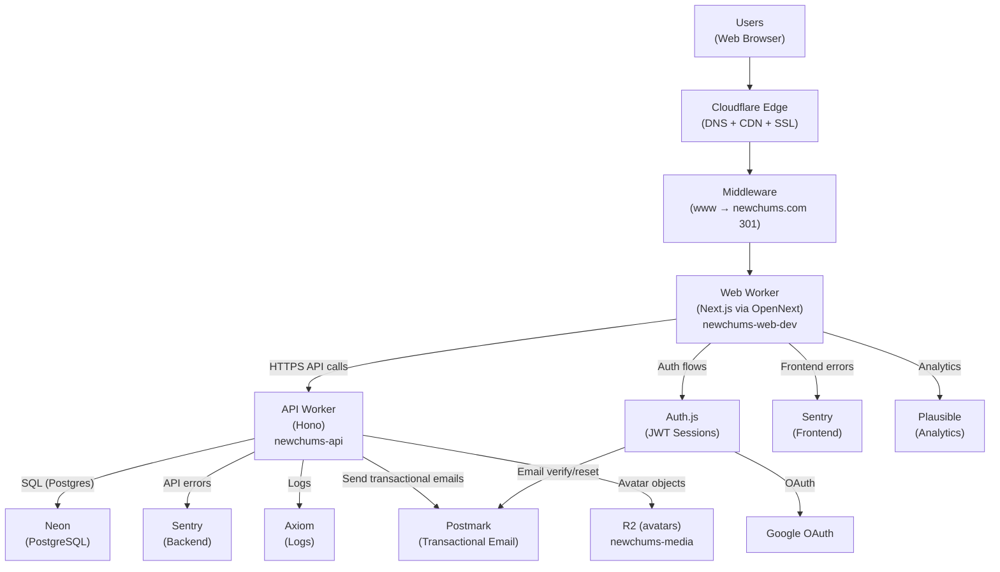
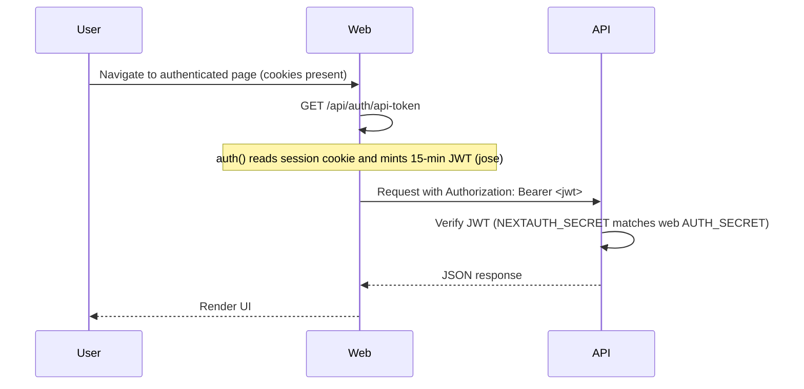
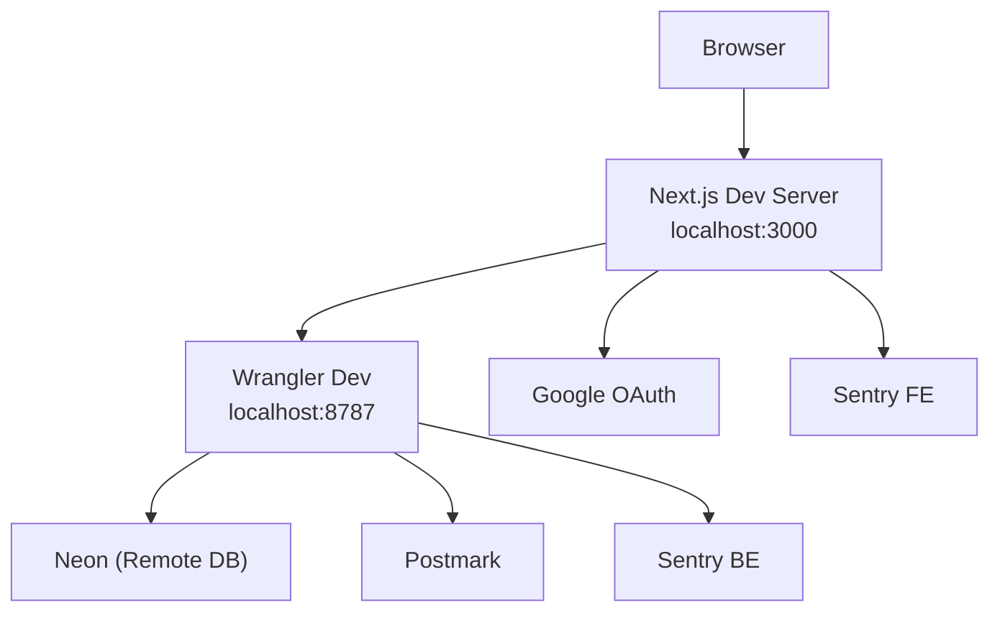
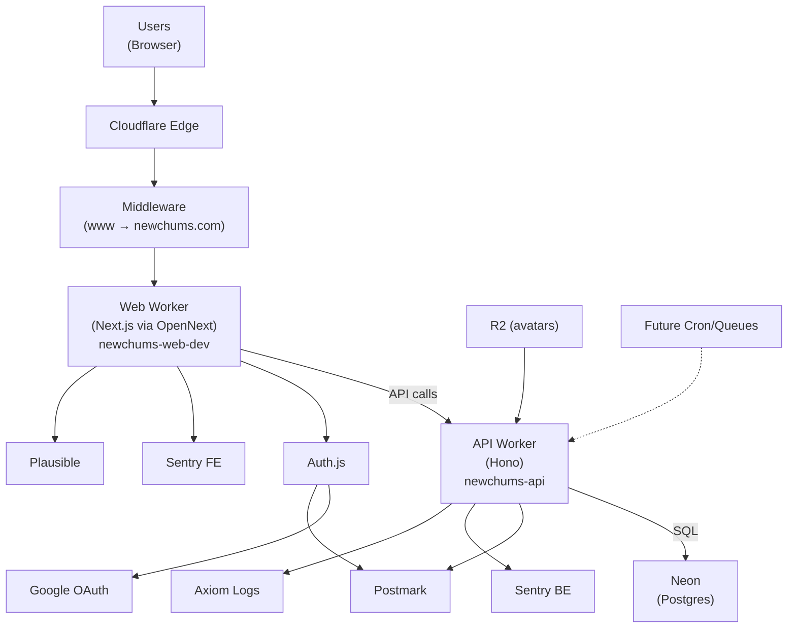

# System Map

Last Updated: March 7, 2026

This document reflects the current production reality of NewChums.
It is diagram-first: use this for boundaries, flows, and “how it connects.”

---

## Production Reality (Current)

- **Single production environment**
- **Web Worker:** `newchums-web-dev` (production; suffix mismatch acknowledged but stable)
- **API Worker:** `newchums-api`
- **Canonical host:** `https://newchums.com`  
  - `www.newchums.com` → `newchums.com` enforced via middleware **before** Auth.js
- **Custom domains:** `newchums.com`, `www.newchums.com` (configured in `web/wrangler.toml`)

---

## 1) Big‑Picture Production Architecture

---

## 2) Canonical Host Model (OAuth Safety)

All requests to `www.newchums.com` are 301-redirected to `https://newchums.com` (same path + query) **before** Auth.js runs.

This ensures:
- OAuth sign-in and callback share the same origin
- PKCE `code_verifier` cookie is present on callback
- `AUTH_URL` / `NEXTAUTH_URL` remain `https://newchums.com`

Middleware: `web/src/middleware.ts`  
Matcher includes `/api/auth/*` (OAuth flow), excludes static assets.

---

## 3) API Migration (Web → API Worker)

The following flows run in the API worker; the web app calls the API via `NEXT_PUBLIC_API_BASE_URL`:

| Flow | API endpoint(s) | Auth |
|------|------------------|------|
| Signup | `POST /auth/signup` | none |
| Email verification | `POST /auth/email-verify/request`, `POST /auth/email-verify/confirm`, `GET /auth/email-verify/status` | none |
| Password reset | `POST /auth/password-reset/request`, `POST /auth/password-reset/confirm` | none |
| Email change | `POST /account/email-change/request`, `POST /account/email-change/confirm` | Bearer JWT |
| Password change | `POST /account/password-change` | Bearer JWT (credentials users only) |
| Account deletion | `DELETE /account` | Bearer JWT |
| Notification prefs | `GET /notification-preferences`, `PUT /notification-preferences` | Bearer JWT |
| Privacy prefs | `GET /profile`, `PUT /profile` (is_hidden_from_search, is_hidden_from_external_indexing) | Bearer JWT |
| Interests | `GET /interests` (active only; excludes soft-deleted) | none |
| Profile | `GET /profile` (includes `role`), `PUT /profile` | Bearer JWT |
| Admin — interests | `GET /admin/interests`, `PATCH /admin/interests/:id`, `DELETE /admin/interests/:id`, `POST /admin/interests/:id/restore`, `POST /admin/interests/merge` | Bearer JWT + `super_admin` role |
| Handle availability | `GET /handles/available?handle=...` | Bearer JWT |
| Onboarding | `POST /user/username`, `POST /user/date-of-birth` | Bearer JWT |
| Avatar upload | `POST /media/init` → PUT to uploadUrl → `POST /media/finalize` | Bearer JWT |
| Avatar remove | `DELETE /profile/avatar` | Bearer JWT |
| Avatar image | `GET /users/:userId/avatar` | public |
| Events (plans) | `POST /events`, `GET /events/mine`, `GET /events/:id`, `POST /events/:id/rsvp`, `POST /events/:id/alt-time`, `POST /events/:id/cancel`, `POST /events/:id/invite` | Bearer JWT |

### Content safety

Signup, onboarding username, and profile edits validate:
- display name
- handle/username
- hobbies

Invalid returns 400 with `code: "INAPPROPRIATE_TEXT"` and `field`.

---

## 4) Auth-to-API Token Flow (Bearer JWT)

Authenticated API calls use a short-lived Bearer token minted by the Web Worker:

---

## 5) Local Development Model

- Web dev server: `localhost:3000`
- API dev server: `localhost:8787` (Wrangler dev)
- Neon DB: remote
- Postmark: used for email dispatch (dev/prod tokens as configured)

---

## 6) Deploy Configuration (Production)

| Setting | Value |
|---------|-------|
| Web Worker name | `newchums-web-dev` |
| API Worker name | `newchums-api` |
| Custom domains | `newchums.com`, `www.newchums.com` |
| Canonical host | `https://newchums.com` |
| `workers_dev` | `false` |
| `preview_urls` | `false` |

Wrangler config is code-managed so deploys do not wipe routes or override canonical host vars.

---

## 7) Single Consolidated System Model

