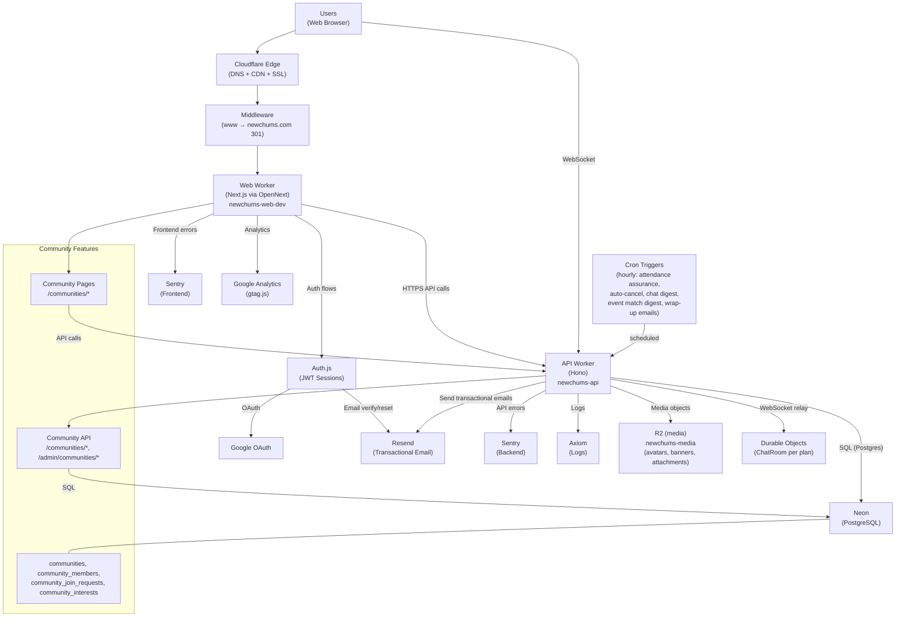
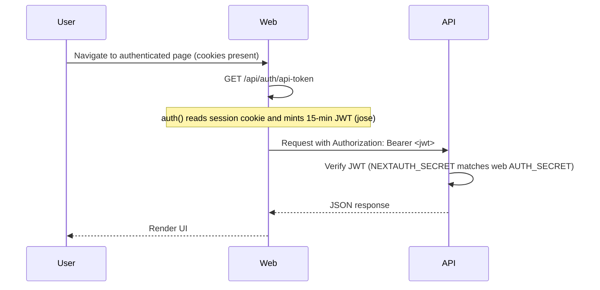
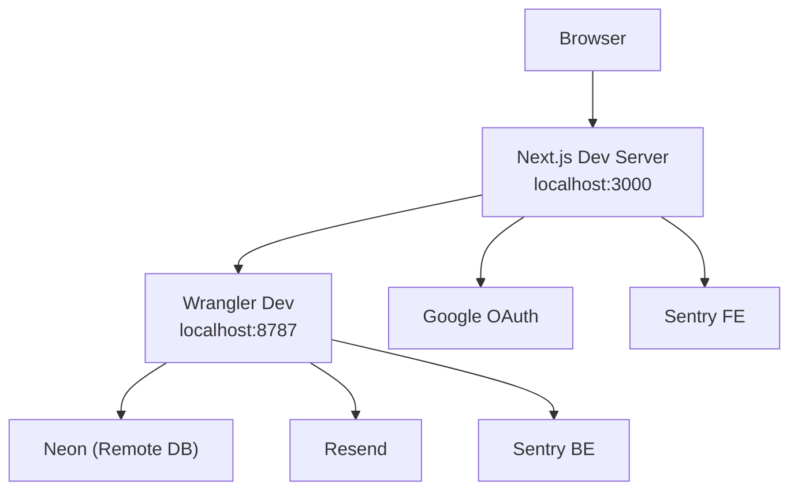

# System Map

Last Updated: May 8, 2026

This document reflects the current production reality of NewChums.
It is diagram-first: use this for boundaries, flows, and "how it connects."

For product context and terminology, see `AGENTS.md`.
For detailed technical specs, see `docs/Technical_Specs.md`.

---

## Production Reality (Current)

- **Single production environment**
- **Web Worker:** `newchums-web-dev` (production; suffix mismatch acknowledged but stable)
- **API Worker:** `newchums-api`
- **Durable Objects:** `ChatRoom` (per-plan WebSocket relay for real-time chat, bound in API worker)
- **Canonical host:** `https://newchums.com`
  - `www.newchums.com` → `newchums.com` enforced via middleware **before** Auth.js
- **Custom domains:** `newchums.com`, `www.newchums.com` (configured in `web/wrangler.toml`)

---

## 1) Big-Picture Production Architecture



---

## 2) Canonical Host Model (OAuth Safety)

All requests to `www.newchums.com` are 301-redirected to `https://newchums.com` (same path + query) **before** Auth.js runs.

This ensures:
- OAuth sign-in and callback share the same origin
- PKCE `code_verifier` cookie is present on callback
- `AUTH_URL` / `NEXTAUTH_URL` remain `https://newchums.com`

Middleware: `web/src/middleware.ts` (with `export const runtime = "experimental-edge"`). We briefly tried the Next.js 16 `proxy.ts` convention and reverted, Next 16 forces `proxy.ts` to the Node runtime, which OpenNext-Cloudflare cannot bundle, and the resulting Worker silently shipped without any middleware. See the file's header comment and `web/scripts/patch-functions-config.js` for the full rationale and deploy guard.

Matcher includes `/api/auth/*` (OAuth flow), excludes static assets.

---

## 3) Organizer subscription plans (implemented, no billing yet)

NewChums defines organizer subscription behavior now, before any billing flow exists.

- **Free**, baseline user and community functionality (default for all users)
- **Super Host**, advanced **plan / event-level** capabilities for a user anywhere they host
- **Community Pro**, advanced **community-level** capabilities for communities owned by that user, and it **includes Super Host benefits**

Implementation:
- `users.subscription_plan TEXT NOT NULL DEFAULT 'free'` (migration 083), constrained to `('free', 'super_host', 'community_pro')`.
- Access helpers: `api/src/lib/subscriptionAccess.ts` exports `hasSuperHostAccess()`, `hasCommunityProAccess()`, `communityInheritsProAccess()`, `getUserSubscriptionPlan()`, `countOwnedCommunities()`.
- `GET /profile` returns `subscription_plan`.
- Admin: `PATCH /admin/users/:id/subscription-plan` with inline dropdown in the Users tab. Changes logged to `subscription_plan_history`.

Current rules:
- Plans are assigned through internal admin tooling. No billing, checkout, or self-service upgrade flow yet.
- **All users** are capped at **5 active owned communities**. Enforced in `POST /communities`; the Create Community UI shows a dialog when the cap is hit. Closing a community frees a slot. `community_pro` covers all 5 for Community Pro users.
- No separate Founding Access layer. Early pilots use manual `super_host` or `community_pro` assignment.
- Premium features should be hidden when unavailable in normal UI.
- Unfinished premium work may stay behind super-admin or QA-only gates until ready.

This keeps the product model stable while avoiding premature checkout, billing state, and downgrade complexity.

## 4) API Boundary, What Lives Where

The following flows run in the API worker; the web app calls the API via `NEXT_PUBLIC_API_BASE_URL`:

| Flow | API endpoint(s) | Auth |
|------|------------------|------|
| Signup | `POST /auth/signup` (with legal acceptance) | none |
| Legal acceptance (OAuth) | `POST /auth/record-legal-acceptance` | Bearer JWT |
| Email verification | `POST /auth/email-verify/request`, `POST /auth/email-verify/confirm`, `GET /auth/email-verify/status`, `POST /auth/email-verify/mark-oauth` | none |
| Password reset | `POST /auth/password-reset/request`, `POST /auth/password-reset/confirm` | none |
| Email change | `POST /account/email-change/request`, `POST /account/email-change/confirm` | Bearer JWT |
| Password change | `POST /account/password-change` | Bearer JWT (credentials users only) |
| Account deletion | `DELETE /account` | Bearer JWT |
| Notification prefs | `GET /notification-preferences`, `PUT /notification-preferences` | Bearer JWT |
| Privacy prefs | `GET /profile`, `PUT /profile` (privacy columns) | Bearer JWT |
| Interests | `GET /interests` (active only; excludes soft-deleted) | none |
| Profile | `GET /profile` (includes `role`), `PUT /profile` | Bearer JWT |
| Public profile | `GET /public/users/:handle` | optional Bearer JWT (auth-aware: logged-out viewers see username only, no name/age/gender) |
| Handle availability | `GET /handles/available?handle=...` | Bearer JWT |
| Objectives / nudge | `GET /objectives/next`, `PUT /objectives/tutorial-off` | Bearer JWT |
| Onboarding | `POST /user/username`, `POST /user/date-of-birth` | Bearer JWT |
| Media upload | `POST /media/init` → `PUT /media/upload/:token` → `POST /media/finalize` | Bearer JWT |
| Avatar remove | `DELETE /profile/avatar` | Bearer JWT |
| Avatar image | `GET /users/:userId/avatar` | public |
| Event banner image | `GET /events/:eventId/banner` | public |
| Community avatar image | `GET /communities/:communityId/avatar` | public |
| Community banner image | `GET /communities/:communityId/banner` | public |
| Chums | `GET /chums`, `GET /chums/search`, `GET /chums/check/:userId`, `POST /chums/:userId`, `POST /chums/private`, `DELETE /chums/:id`, `PATCH /chums/:contactId/note` | Bearer JWT |
| Chum invites | `POST /chums/invite`, `POST /chums/invite/accept` | Bearer JWT |
| Public Chums | `GET /public/users/:handle/chums` | none |
| Public Communities | `GET /public/users/:handle/communities` | none. Lists the profile owner's active community memberships (closed communities and non-active memberships excluded). Returns `{ ok: true, communities: [], hidden: true }` when the owner has set `users.is_hidden_communities = true`. Private communities appear in the list when the owner is a member; click-through to `/communities/:slug` still applies normal access rules. |
| Events (plans) | `POST /events`, `GET /events/mine`, `GET /events/:id` (optional auth, returns `accessState` + `shareToken`), `GET /events/explore` (auth), `GET /events/explore/public` (no auth), `GET /events/recently-happened/public` (no auth, social-proof feed of recent past public plans), `PATCH /events/:id`, `POST /events/:id/cancel` | Bearer JWT (detail: optional; accepts `invite_token` or `share_token`); explore/public + recently-happened/public: no auth |
| Lightweight plan signup | `POST /auth/plan-signup/request`, `POST /auth/magic-link/consume` | none (rate-limited + Turnstile) |
| Explore support | `GET /explore/local-signal` | Bearer JWT |
| Plan RSVP | `POST /events/:id/rsvp`, `POST /events/:id/confirm` | Bearer JWT |
| Plan alt times | `POST /events/:id/alt-time`, `PATCH /events/:id/alt-time/:altTimeId`, `DELETE /events/:id/alt-time/:altTimeId`, `POST /events/:id/promote-alt-time` | Bearer JWT |
| Plan attendee mgmt | `POST /events/:id/invite`, `POST /events/:id/remove-attendee`, `POST /events/:id/remove-invite`, `POST /events/:id/reserve-seats`, `POST /events/:id/toggle-attendee-invites` | Bearer JWT (host only) |
| Plan join requests | `POST /events/:id/join-request`, `POST /events/:id/join-request/:requestId/approve`, `POST /events/:id/join-request/:requestId/decline`, `POST /events/:id/join-request/:requestId/withdraw` | Bearer JWT |
| Plan lock | `POST /events/:id/lock` | Bearer JWT (host only) |
| Plan privacy | `POST /events/:id/hide-name` | Bearer JWT. Toggles the viewer's `hide_name` flag on their RSVP. When active, real name is masked in attendee list; @handle and avatar remain visible. |
| Post-plan wrap-up | `GET /events/:id/wrap-up`, `POST /events/:id/wrap-up/dismiss`, `POST`/`DELETE /events/:id/attendance-issue` (host-only), `POST /events/:id/attendance-dispute`, `POST /events/:id/conduct-report`, `POST /events/:id/shoutout` | Bearer JWT |
| Shout-outs | `GET /public/users/:handle/shoutouts` (approved shout-outs on the recipient's public profile, gated by `is_hidden_shoutouts`; auth optional, owner sees their own items even when hidden), `POST /events/:id/shoutout` (sender) | Optional Bearer JWT (owner) / Bearer JWT (sender) |
| Attendance record | `GET /public/users/:userId/attendance-record` | none. Response includes `badges` array with local recognition badges (Top Attendee, Top Host) computed from rolling 12-month activity within 50 km. |
| Plan chat | `GET /events/:id/chat`, `POST /events/:id/chat`, `POST /events/:id/chat/read`, `GET /events/:id/chat/ws` (WebSocket upgrade) | Bearer JWT |
| Notifications | `GET /notifications` (includes `unreadChats`), `POST /notifications/read` | Bearer JWT |
| Email unsubscribe | `POST /email/unsubscribe` | Signed JWT token |
| Contact form | `POST /contact` | none (Turnstile for logged-out) |
| Roadmap | `GET /roadmap`, `GET /roadmap/:id`, `POST /roadmap`, `PUT /roadmap/:id`, `DELETE /roadmap/:id`, `POST /roadmap/:id/vote`, `POST /roadmap/:id/follow`, `POST /roadmap/:id/comment`, `GET /roadmap/:id/attachment` | Bearer JWT. List and detail endpoints filter out "received" status items unless viewer is author or super_admin. Anonymous submissions (`is_anonymous`) show `@anonymous` publicly; admin endpoints always show real author. Statuses: received, needs_clarification, in_progress, planned, completed, not_planned. |
| Admin, interests | `GET /admin/interests`, `GET /admin/interests/categories`, `PATCH /admin/interests/:id`, `DELETE /admin/interests/:id`, `POST /admin/interests/:id/restore`, `POST /admin/interests/merge` | Bearer JWT + `super_admin` role |
| Admin, users | `GET /admin/users`, `POST /admin/users/:id/suspend`, `POST /admin/users/:id/unsuspend`, `PATCH /admin/users/:id/subscription-plan`, `GET /admin/users/:id/diagnostics`, `PUT /admin/users/:id/metrics` | Bearer JWT + `super_admin` role |
| Admin, safety | `PUT /admin/attendance-issues/:id/status`, `GET /admin/concern-reports`, `PUT /admin/concern-reports/:id/status` | Bearer JWT + `super_admin` role |
| Admin, shout-outs | `GET /admin/shoutouts`, `POST /admin/shoutouts/:id/status` (approve/reject; approval inserts a `shoutout_received` notification for the recipient, no email; the bell deep-links to `/u/<handle>#shoutouts`) | Bearer JWT + `super_admin` role |
| Admin, dashboard | `GET /admin/badge-counts`, `POST /admin/mark-viewed`, `GET /admin/kpis`, `GET /admin/kpis/growth-loop/filters`, `GET /admin/kpis/growth-loop`, `GET /admin/objectives/kpi` | Bearer JWT + `super_admin` role |
| Admin, plans | `GET /admin/plans`, `POST /admin/plans/:id/remove` | Bearer JWT + `super_admin` role |
| Admin, roadmap | `GET /admin/roadmap`, `POST /admin/roadmap/:id/status`, `POST /admin/roadmap/:id/merge`, `POST /admin/roadmap/:id/edit`, `POST /admin/roadmap/:id/remove`, `POST /admin/roadmap/:id/restore`, `DELETE /admin/roadmap/comments/:id` | Bearer JWT + `super_admin` role |
| Communities | `POST /communities`, `GET /communities`, `GET /communities/slug-available`, `GET /communities/:slug`, `PATCH /communities/:slug`, `POST /communities/:slug/close`, `DELETE /communities/:slug`, `POST /communities/:id/join`, `POST /communities/:id/leave`, `GET /communities/:id/members`, `POST /communities/:id/members/:userId/remove`, `PUT /communities/:id/join-requests/:requestId`, `GET /communities/:id/join-requests`, `GET /communities/:id/events`, `GET/POST/PATCH/DELETE /communities/:id/announcements`, `POST /communities/:id/announcements/seen`, `PUT /communities/:id/announcement-mute`, `GET/POST/PATCH/DELETE /communities/:id/schedule-blocks` | Bearer JWT |
| Public communities (logged-out discovery) | `GET /public/communities` | none. Public-only (`visibility = 'public'`) discovery feed, the community equivalent of `GET /events/explore/public`. Powers the logged-out render of `/communities`. Private communities are filtered out entirely. |
| Organizer plans / premium access | `PATCH /admin/users/:id/subscription-plan` assigns `free`, `super_host`, or `community_pro` at the user level; community-level premium access is derived from the owner's plan via `communityInheritsProAccess()`. | Bearer JWT + `super_admin` role |
| Admin, communities | `GET /admin/communities`, `POST /admin/communities/:id/remove` | Bearer JWT + `super_admin` role |
| Diagnostics | `GET /`, `GET /health`, `GET /health/env`, `GET /health/db`, `GET /db/ping`, `GET /db/postgis` | none |

### Plan feeds, community linkage, and "Only show this plan to community members"

**Core principle:** Community linkage is organizational context, not audience expansion. Linking a plan to a community never widens its audience beyond what the plan's base `visibility` setting allows. Separately, premium community modules are intended to follow the owner's assigned organizer plan, not the viewer's membership status alone.

Two distinct feeds surface plans; the per-plan `hide_from_explore` toggle (UI label: "Only show this plan to community members") gates Explore only.

| Feed | Endpoint | Governed by |
|---|---|---|
| Explore (authenticated) | `GET /events/explore` | Plan `visibility` + `hide_from_explore` + community-member / RSVP bypass + chum-prefs + distance + hobby |
| Explore (public, anonymous) | `GET /events/explore/public` | `visibility='public'` + `hide_from_explore=false` + `is_qa=false` |
| Community plan feed | `GET /communities/:id/events` | Joins through `event_communities` to scope to plans linked to this community, plus per-plan `visibility` gate (invite_only excluded entirely; chums_only scoped to host + host's on-NewChums chums + RSVP'd viewers; public always shown). Endpoint access is gated by community privacy (private communities: members + super admin). No `hide_from_explore` filter on rows. **Logged-out viewers** receive a server-derived `locationDisplay` (approximate area or "Online"); exact `locationName` / `locationAddress` / `locationLat` / `locationLng` / `onlineLink` are returned as `null` so a public community page never leaks an exact venue or meeting link. Authenticated viewers continue to receive the full location set. |

Visibility × community-linkage matrix (applies to all three feeds):

| Plan `visibility` | Can link to community? | Community feed | Explore |
|---|---|---|---|
| `public` | Yes | Shown | Shown; `hide_from_explore` governs non-member visibility |
| `chums_only` | Yes | Shown only to host, host's on-NewChums chums, and RSVP'd viewers | Same chums_only rule; `hide_from_explore` layers on top |
| `invite_only` | No (server forces `community_ids = []` on POST and PATCH) | Never shown | Hidden except to viewers already RSVP'd |

Toggle states (per plan, shown only when a community is selected and `visibility != 'invite_only'`):

- **OFF (`hide_from_explore=false`, default):** per the matrix above.
- **ON (`hide_from_explore=true`):** community feed unchanged (base `visibility` still applies); in Explore the plan is limited to viewers who would already satisfy the matrix as active community members or RSVP'd viewers.

Community `visibility` (`public` / `private`) gates the community page and plan feed **endpoint**, not individual-plan Explore visibility. A public plan in a private community with the toggle off still appears in Explore for non-members. Full contract: `AGENTS.md` → Plan Feed and Community Visibility Contract; `docs/Technical_Specs.md` → Communities → Plan Feeds, Community Linkage, and "Only show this plan to community members" Toggle.

**"Recently happened" social-proof feeds.** Three surfaces show a small section of recent past public plans below the upcoming list:

| Surface | Endpoint | Recency window |
|---|---|---|
| Logged-out landing + logged-in Explore | `GET /events/recently-happened/public` | last 30 days |
| Community detail page | `GET /communities/:id/events?past=true` | last 90 days |

Both apply the same visibility / QA / `hide_from_explore` filters as their upcoming counterparts (the public Explore feed and the upcoming community feed respectively). Both additionally require a participation signal, at least one **non-host RSVP marked Going**, so lonely past plans are never surfaced as social proof. Past plan cards render with `isPast` (grayscale, "Happened today / yesterday / Apr 28" label) and `hideRsvp` so they cannot be confused with joinable plans.

### Community premium direction

- The subscription/access framework is **implemented** (migration 083, `api/src/lib/subscriptionAccess.ts`). Communities inherit `community_pro` from their owner's plan. No premium features are wired to the framework yet.
- **Community chat** is still unimplemented and is intended to become the first **Community Pro** feature.
- Community Pro should be understood as a cleaner extension of community ownership rather than a separate community-type system. Avoid branching the product into rigid community verticals.
- The near-term community goal remains the smallest organizer operating system that creates obvious value: a shareable public hub, membership, plans, communication, legitimacy, and easy sharing.

### QA plan isolation

Plans with `is_qa = true` are isolated from normal users but fully functional for super admins.

**Normal users** never see QA plans. They are excluded from:
- All feeds, notifications, emails, and chat
- Direct URL access (returns 404)
- RSVP, invite, join request, and all interaction endpoints

**Super admins** get a fully realistic experience with QA plans:
- QA plans appear in Explore feed, Your Plans, community plan feeds
- `GET /communities/:id/events` exposes `isQa` on each row so QA badges render on super-admin-visible cards
- Community-card counts that super admins see (e.g. `upcoming_plan_count` in `/communities`) bypass the QA filter so the count reflects what the viewer can actually see
- Cron jobs (attendance assurance, event match digest, chat digest, wrap-up emails) process QA plans and send emails/notifications to super admin recipients only
- Auto-cancel and attendance cutoff processing runs normally on QA plans
- QA plans are excluded from KPI metrics and the public (unauthenticated) explore feed

Enforcement: every list query that returns plan rows or plan counts uses `AND (COALESCE(e.is_qa, false) = false OR <viewer_is_super_admin>)`. Single-event endpoints check `is_qa` and verify super_admin role, returning 404 for non-admins. Cron jobs check recipient role via `batchLoadSuperAdminIds()` before sending. This invariant applies equally to community plan queries and counts; see the Plan feeds subsection above for the full contract.

### Content safety

Signup, onboarding username, and profile edits validate:
- display name
- handle/username
- hobbies

Invalid returns 400 with `code: "INAPPROPRIATE_TEXT"` and `field`.

---

## 4) Auth-to-API Token Flow (Bearer JWT)

Authenticated API calls use a short-lived Bearer token minted by the Web Worker:



---

## 5) Key User Flows

### Background scheduled tasks (API `scheduled`, hourly cron)

The hourly cron runs ten tasks in sequence:

1. **Attendance assurance** -- validates and manages event attendance. All of its emails (confirmation request, the 12h and 3h follow-ups, host at-risk alert, auto-cancel notices) are enqueued to the email outbox with per-send idempotency keys rather than sent inline (Aug 2026); bell notifications stay immediate. Includes Phases 1-3 of the 24-hour attendance check (open window, reminders, cutoff with `min_confirmed_attendees` evaluation against `event_confirmations`) and a Phase 4 RSVP-based threshold (`min_attendees_required`) that auto-cancels a plan 2 hours before start when fewer than the configured number of "going" RSVPs exist (host counts). Phase 4 runs after Phase 3 and only acts on `status = 'published'` rows, so a plan already cancelled in the same tick by Phase 3 is skipped, no double cancellation email. Cancellation reasons are distinct: Phase 3 uses `min_attendees_not_met`, Phase 4 uses `min_attendees_required_not_met`. Both are excluded from host-completion / host-follow-through metric denominators alongside `no_attendees`.
2. **Auto-cancel plans** -- cancels published plans whose event time has passed with no attendees beyond the host (within a 2-hour window)
3. **Unread chat digest** -- sends digest emails for unread chat messages (daily gate, 23-hour cooldown)
4. **Event match digest** -- “new plans matching my interests.” Recipients need home location, travel radius, and the `event_match` preference. **Public** in-person plans require **effective-category overlap** with the plan within travel radius (and the other digest gates). **Chums-only** in-person plans use the **same** category and distance rules; the recipient must also be on the **host’s** On NewChums connections (`user_contacts`, `type = ‘on_newchums’`). **Invite-only** plans are excluded. **Already-connected suppression:** plans where the recipient already has any RSVP row (any status) or any invite row (matched by `user_id` or by `LOWER(email) = LOWER(users.email)`) are excluded so the digest never overlaps with direct outreach. *Effective category* of an interest is `LOWER(COALESCE(NULLIF(TRIM(category), ''), name))` -- so two interests in the same admin-assigned category match (e.g. "MTG Draft" and "MTG Commander" with category `MTG`), and an interest with no category falls back to its own name. The same effective-category rule is applied by the authenticated Explore feed (hobby filter + match-count ranking), the public Explore feed (hobby filter), and the local-signal endpoint at the bottom of the Explore feed. The shared TypeScript helper is `effectiveCategoryOf` in `web/src/lib/interestUtils.ts`.
5. **Post-plan wrap-up emails** -- role-varied (host check-in framing, attendee thank-you framing), sent 3+ hours after plan start to going attendees + host
6. **"Run it again" nudge** -- 48+ hours after a plan started (and 24+ hours after its wrap-up email actually went out, so the two never share a day), the host gets a one-time bell notification + email offering to prefill a new plan via `?copy_from=`. Skips cancelled plans, plans with no (or all-no-show) non-host attendance, hosts who already made or scheduled another plan, QA plans for non-super-admins, hosts with the `run_it_again` pref off, and second plans by the same host in one run. Dedupe column `events.run_again_nudge_processed_at` (migration 108), stamped whether sent or skipped.
7. **Day-before plan reminder** -- plans WITHOUT the 24-hour attendance check email host + going attendees a plain reminder in the [T-24h, T-21h] window (`events.reminder_processed_at`, migration 112, backfilled at launch). The floor keeps it 24h+ from the wrap-up email; late entry skips with a stamped reason. Gated per recipient on the `plan_reminder` pref (default on, unsubscribe-scoped); QA plans reach super admins only. Check-ON plans are excluded entirely: their confirmation request is the day-before touch, so nobody hears twice.
8. **Shout-out notices** -- once a day (gated to 16:00 UTC), emails recipients about shout-outs that cleared moderation since the last run, batched one email per recipient. Approval itself only ever created a bell notification, which most recipients never saw. Stamped per shout-out (`shoutouts.notified_at`, migration 113, backfilled to four days before launch); skips the `shoutout_received` pref when off and re-checks blocked pairs at send time.
9. **Email outbox delivery** -- delivers the per-recipient rows the wrap-up and nudge jobs enqueue (`newchums.email_outbox`, migration 110), with bounded retries: 429/5xx retry up to 3 attempts with a stable Idempotency-Key, other 4xx give up as permanent, and network-level failures with no HTTP response are marked `ambiguous` and never retried (a duplicate email is worse than a missed one). Failed sends are recorded (`status`, `attempts`, `last_error`) instead of vanishing.
10. **Activity log retention** -- deletes `user_activity_log` rows older than 90 days (per-request admin activity tracking, migration 101; also runs alongside the local recognition badges refresh)

Digest candidate selection is hobbies + travel radius + visibility/QA/members-only gates + a blocked-pairs gate (`user_blocks`, both directions, both UNION branches). The chum-preference post-filter that used to run here was removed with the matching system in July 2026.

### Logged-out visitor flow

```
Visit newchums.com → Homepage (LandingLayout)
├── Public Explore feed, browse real public plans (search, time filter, pagination)
│   └── Click plan → Public plan details (preview with anonymized "Who's in" + locked alt-time section; no RSVP)
├── Browse: How it Works, Science of Friendship, Safety Center
├── Contact form
├── Sign up (multi-step: credentials + legal acceptance → username/DOB → hobbies → location) → Email verification → Dashboard
├── Sign up (Google OAuth + legal acceptance) → Onboarding (username/DOB → hobbies → location) → Dashboard
└── Sign in → Dashboard (Explore)
```

### Logged-in core flow

```
Sign in → Explore (event discovery feed)
├── Start a plan → Create event form (option: copy a previous plan via picker) → Publish → Your Plans
├── Explore → Browse events → RSVP / Suggest alt time / Request to join
│   └── Local signal (bottom of feed) → "{count} active people near you are into {hobby}"
├── Your Plans → Upcoming / Past tabs → Event detail
│   ├── Edit plan (host) → Edit event form
│   ├── Copy plan (host, incl. past/canceled) → pre-filled create form → Publish as new plan
│   └── Past plan → Post-plan wrap-up (Say thanks: shout-outs + Save to Chums; hosts: private attendance check-in + Run it again)
├── Your Chums → Search / Add / Remove / Invite by email / Message
├── Inbox → 1:1 direct messages (async, email-like) → reply / block / report
│   └── Entry points: profile Message button, post-plan attendee rows, Your Chums rows
├── Communities → Browse / Create / Join / Community plans feed
├── Roadmap → Browse / Vote / Follow / Comment on feature requests
├── Profile → Edit → Public profile (/u/handle)
├── Settings → Notifications / Privacy / Email / Password / Delete account
├── Notifications (bell) → View / mark read
└── Next-step nudge (above page content, all views) → contextual objective → dismiss / turn off
```

### Plan access state flow

Every `GET /events/:id` request resolves to one of four access states based on the viewer's identity and context:

```
Visit /events/[id]
├── No auth, no token → accessState: "public"
│   └── Limited preview (title, description, date, hobby, host, counts, approximate location)
│       └── CTA: Sign in / Create account
│       └── No RSVP flow
├── ?share_token=xxx (Copy Link) → accessState: "invite"
│   └── Full plan detail (read-only) + lightweight-signup card
│       └── Submit email + DOB + legal → magic-link email → click to create account, sign in, return to plan
├── ?invite_token=xxx (invite email) → accessState: "invite"
│   └── Full plan detail (read-only) + lightweight-signup card (email pre-filled)
│       └── On magic-link completion, matching event_invites row is adopted onto the new user
├── Logged in, not attending → accessState: "authenticated"
│   └── Full detail, can RSVP or request to join
└── Logged in + host or RSVP → accessState: "attending"
    └── Full detail + chat, host controls, exact location
```

**Share-link flow (post-migration 084):** Copy Link → generates `/events/[id]?share_token=xxx` → recipient opens link → API validates token → `accessState: "invite"` → plan preview + lightweight signup card. After magic-link click, they return as an authenticated user and RSVP normally via `POST /events/:id/rsvp`. The former guest participation endpoints (`POST /events/:id/email-rsvp`, `/public-rsvp/request-code`, `/public-rsvp/confirm-code`, `/guest-confirm`, `/guest-alt-time`) have been removed.

---

## 6) Local Development Model

- Web dev server: `localhost:3000`
- API dev server: `localhost:8787` (Wrangler dev)
- Neon DB: remote
- Resend: used for email dispatch (dev/prod API keys as configured)



---

## 7) Deploy Configuration (Production)

| Setting | Value |
|---------|-------|
| Web Worker name | `newchums-web-dev` |
| API Worker name | `newchums-api` |
| Custom domains | `newchums.com`, `www.newchums.com` |
| Canonical host | `https://newchums.com` |
| `workers_dev` | `false` |
| `preview_urls` | `false` |

Wrangler config is code-managed so deploys do not wipe routes or override canonical host vars.

---

## 8) Web App Route Map

### Public routes (LandingLayout)

| Route | Purpose |
|-------|---------|
| `/` (logged out) | Homepage, hero, public Explore feed (real public plans via `/events/explore/public`), brand positioning, feature blocks, CTA |
| `/how-it-works` | How it works |
| `/science-of-friendship` | Research-backed trust page |
| `/safety-center` | Community safety guidance |
| `/contact` | Contact form (Turnstile for logged-out) |
| `/login` | Sign in |
| `/signup` | Create account (multi-step wizard) |
| `/forgot-password` | Request password reset |
| `/reset-password` | Set new password |
| `/auth/verify` | Email verification landing |
| `/auth/verify/pending` | Verification pending polling page |
| `/auth/email-change/confirm` | Email change confirmation landing |
| `/onboarding/username` | Onboarding: set username |
| `/onboarding/date-of-birth` | Onboarding: set date of birth |
| `/u/[handle]` | Public profile (works logged-in or out; logged-out viewers see reduced info: username only, no name/age/reliability) |
| `/communities` (logged out) | Public Communities discovery feed (public-only `visibility` via `/public/communities`). Lives physically in `(app)/communities/page.tsx` and is allowlisted in the `(app)` layout so logged-out visitors render without an auth redirect; the page renders `PublicCommunitiesExplore` when there is no session and `CommunitiesListClient` when there is. |
| `/communities/[slug]` | Public community detail page (works logged-in or out; privacy contract enforced by `GET /communities/:slug`) |
| `/events/[id]` (logged out) | Plan detail, public preview with limited info and sign-in CTA |
| `/roadmap` | Public product roadmap, vote and follow items. Items with "Received" status are only visible to the author and super admins; once reviewed and moved to another status they appear publicly. |
| `/roadmap/[id]` | Roadmap item detail, comments, voting. Returns 404 for "Received" items unless viewer is the author or a super admin. |
| `/terms` | Terms of Use |
| `/privacy` | Privacy Policy |
| `/unsubscribe` | Email notification unsubscribe (public, token-based) |
| `/qr/[code]` | QR redirect public surface. Resolves the code via `POST /public/qr/:code/scan` and 302s to the destination; HEAD requests do not log a scan. |

### Logged-in routes (AppShell)

| Route | Purpose |
|-------|---------|
| `/` (logged in) | Explore, event discovery feed |
| `/events/create` | Start a plan (create event); `?copy_from=<planId>` pre-fills the form from a plan the viewer hosted (Copy plan), and a header action opens a picker of the viewer's hosted plans that does the same in place |
| `/plans` | Your Plans, upcoming / past tabs |
| `/events/[id]` | Event detail, full experience with RSVP, attendees, chat, lock, cancel (access state: authenticated/attending). Past plans show post-plan feedback section. |
| `/events/[id]/edit` | Edit an existing event (host only) |
| `/chum-groups` | Your Chums, search, invite, list |
| `/profile` | Edit profile |
| `/settings` | Notifications, privacy, account |
| `/communities` | Community discovery feed with search, distance/hobby filtering, personalization, All/Yours scope |
| `/communities/create` | Create community with rich text description, required hobbies, online/offline, location, website, join link |
| `/communities/[slug]` | Community detail with hobbies, online/website/Discord link, members, plan feed, announcements tab, schedule tab (recurring weekly time blocks), join/leave, join-request management |
| `/communities/[slug]/edit` | Edit community settings (owner), same form quality as create |
| `/your-plan` | Read-only Your Plan page showing the viewer's organizer subscription tier (free / super_host / community_pro) |
| `/inbox` | Direct messages: two-pane inbox (conversation list + thread), compose via `?to=`, thread via `?c=` |
| `/admin/qr-redirects` | QR redirects inventory (super_admin) |
| `/admin/qr-redirects/[id]` | QR redirect detail + recent scans (super_admin) |
| `/admin/shoutouts` | Shout-out moderation queue (super_admin) |
| `/admin/interests` | Interests moderation (super_admin) |
| `/admin/chums` | User management (super_admin) |
| `/admin/chums/[id]` | User diagnostics: attendance records, conduct reports, objectives, recent activity (super_admin) |
| `/admin/communities` | Community management, list, search, remove (super_admin) |
| `/admin/kpis` | KPI dashboard, growth loop analytics (super_admin) |
| `/admin/kpis/activity` | Per-request user activity log, drill-in from the KPI Return behavior section (super_admin) |
| `/admin/plans` | Plan management, list, search, remove (super_admin) |
| `/admin/safety` | Concern reports, attendance issues management (super_admin) |
| `/admin/roadmap` | Roadmap item moderation, status, merge, remove (super_admin) |

---

## 9) Single Consolidated System Model


