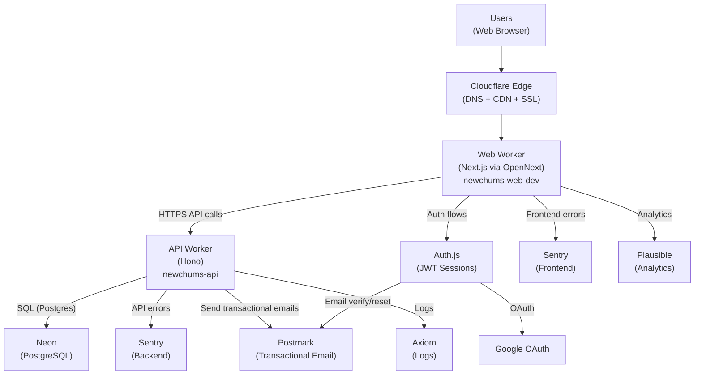
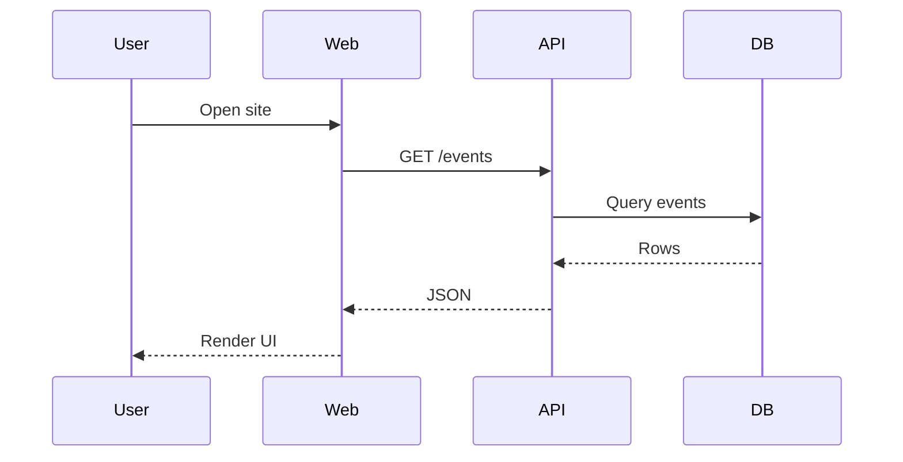
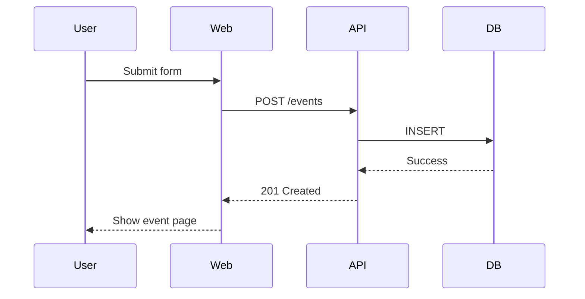
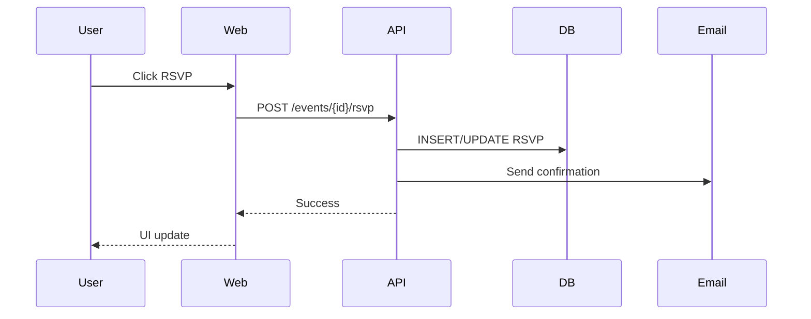
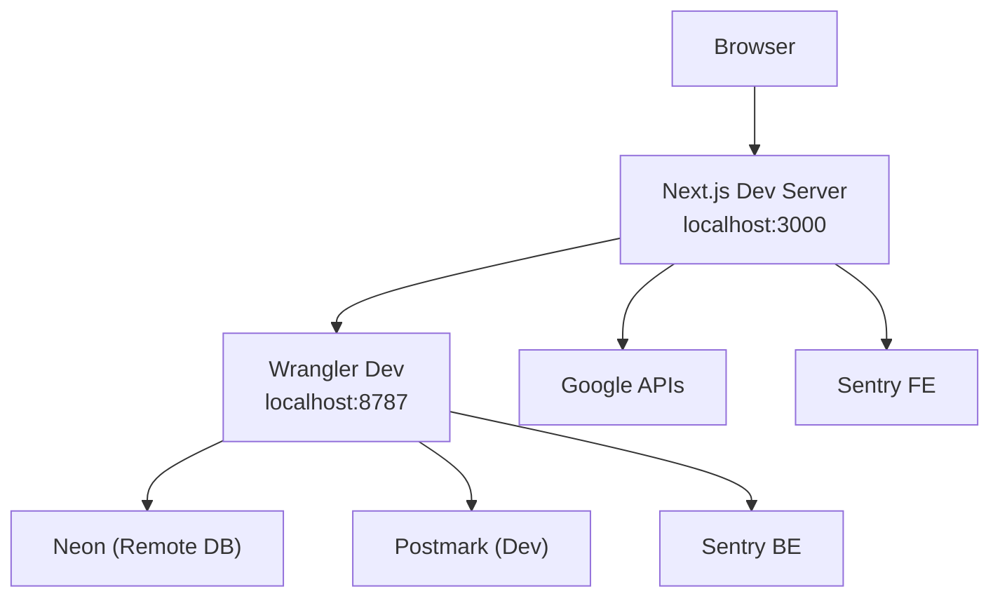
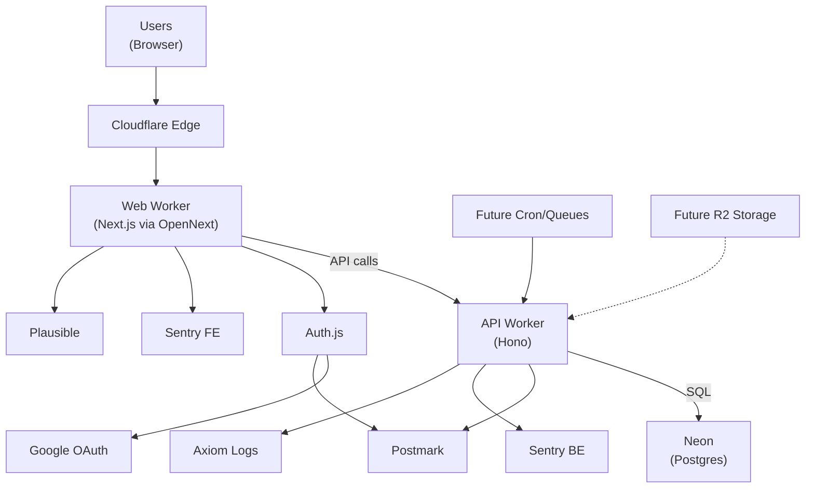

# System Map

Last Updated: February 24, 2026

This document reflects the current production reality of NewChums.

Production Workers:
- Web Worker: newchums-web-dev (production despite suffix)
- API Worker: newchums-api
- Single production environment
- Domain binding to newchums.com pending

---

# 1) Big‑Picture Production Architecture

---

# 2) Core User Flows

## Browse Events

## Create Event

## RSVP

---

# 3) Local Development Model

---

# 4) Architectural Commitments

- Two-worker model is intentional and long-term.
- Business logic belongs in API Worker.
- Web Worker focuses on UI and auth orchestration.
- Some legacy API logic exists in Web Worker (technical debt).
- R2 and background jobs (Cron/Queues) are planned but not yet implemented.
- Single production environment currently active.

---

# 5) Single Consolidated System Model

